안녕하세요. 이번 글에서는 가짜연구소가 DataCamp와 파트너쉽을 맺어 진행한 Data Science Fellowship 프로그램에 대해 소개드리고자 합니다. 

## 가짜연구소 소개
가짜연구소가 처음이신 분들도 있을 것 같아, 먼저 가짜연구소에 대해 간단히 설명을 드리겠습니다. 가짜연구소는 2020년에 결성된 비영리 머신러닝 커뮤니티로, 머신러닝 연구를 중심으로 모인 커뮤니티입니다. 오픈의 가치를 추구하며, 좋은 영향력을 끼칠 수 있는 그룹을 만들고자 합니다. 이윤을 추구하는 집단이 아니기 때문에 이로부터 자유로운 활동을 하고 있으며, 예측할 수 없는 비선형적인 성장과 너드 문화를 선도하며 사소하고 재밌는 일들을 해오고 있습니다. 그렇기 때문에 가짜연구소는 다양한 프로젝트와 스터디를 진행하며, 머신러닝에 관심 있는 사람들이 함께 성장할 수 있는 공간을 제공합니다. 자세한 소개는 [가짜연구소 홈페이지](https://pseudo-lab.com/Pseudo-Lab-c42db6652c1b45c3ba4bfe157c70cf09)를 참고 부탁립니다. 현재 [디스코드](https://discord.gg/HeHbFAvmSZ)를 통해 커뮤니티를 운영하고 있으므로 방문해 보시는 것도 가짜연구소의 활동을 이해하시는데 좋을 것 같습니다.

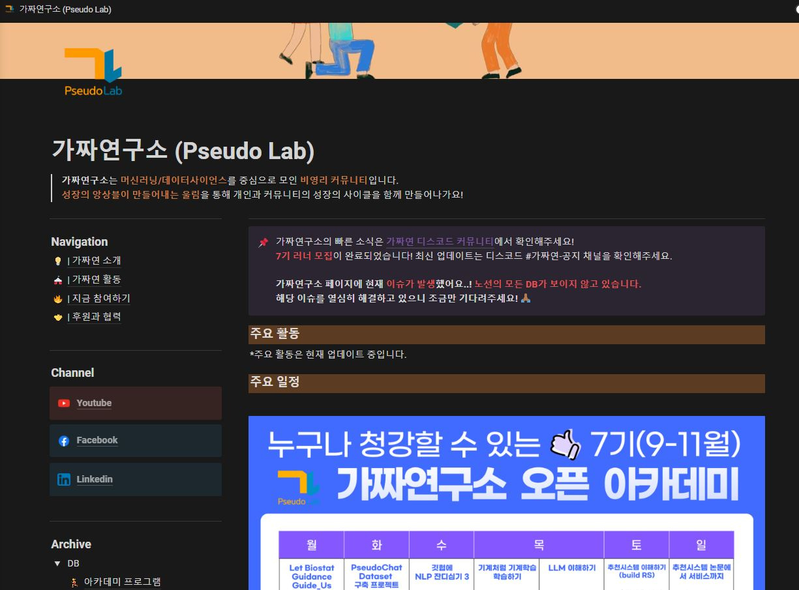
- 가짜연구소 홈페이지 

## DataCamp Donates 신청하게된 배경 
저는 개인적으로 인공지능 활용 분야 및 소식에 관심이 많아 가짜연구소 외에도 카톡 단톡방으로 운영되는 국내의 여러 인공지능 커뮤니티에 들어가서 종종 소식을 팔로우업 하고 있습니다. 그러던 중 어느 단톡방에서 DataCamp Donates에 대한 소식이 공유되어 관심을 갖고 해당 프로그램을 더 깊게 찾아봤습니다. 

DataCamp Donates에 대해 설명드리기에 앞서서 먼저 DataCamp에 대해 소개를 드려야 할 것 같은데요, DataCamp는 웹 브라우저 및 모바일에서 상호작용 가능한 데이터 과학 및 데이터 분석 교육을 제공하는 교육 플랫폼입니다. Google, Intel 등 1,600개 이상의 기업에서 사용하며 Python, R, SQL, Tableau, Power BI 등을 포함한 440개 이상의 강좌를 보유하고 있습니다. 

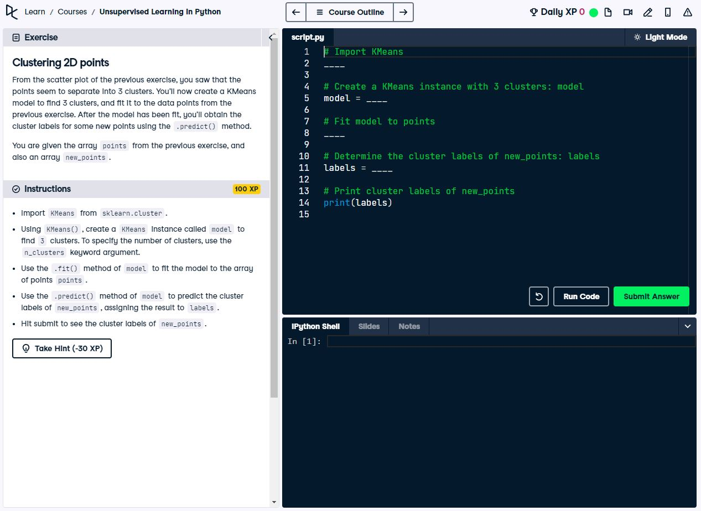
- DataCamp 내부 교육 화면

DataCamp에서 운영하는 사회 기여 프로그램인 DataCamp Donates는 “Provide free data education for those who need it most”를 미션(mission)으로 하는 프로그램입니다. 이 미션을 실현 시키기 위해 DataCamp는 비영리 단체들과 파트너쉽을 맺습니다. 전 세계에 있는 비영리 단체 중, 지원해서 선발된 비영리 단체에게 일정한 개수의 DataCamp 라이센스를 분배합니다. 이 과정을 통해 DataCamp와 파트너쉽을 맺은 단체는, 해당 단체가 운영되고 있는 지역 커뮤니티 내부에서 데이터 과학 교육이 필요한 분들에게 무료로 라이센스를 배분함으로써 DataCamp Donates의 미션을 실현하는데 함께합니다. 자세한 내용은 [공식 사이트](https://www.datacamp.com/donates)에서 확인 가능합니다.

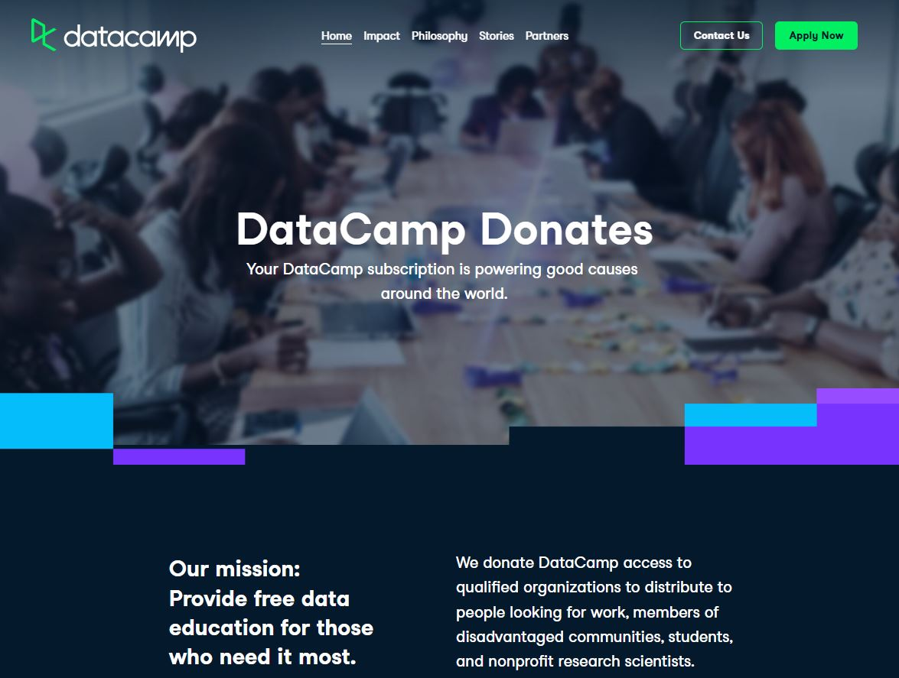
- DataCamp Donates 웹사이트

DataCamp Donates 프로그램에 대해서 조사를 하고 보니, 가짜연구소가 운영되고 있는 취지 및 가치와 부합하다는 생각이 들었습니다. 그래서 가짜연구소 운영진 분들에게 해당 프로그램을 공유드려 보았는데 운영진 분들께서도 많은 공감을 해주셨습니다. 그에 따라 지원에 필요한 자료들을 준비하여 2021년 5월 20일에 지원 메일을 보냈습니다. 그 당시에는 지원 메일을 보내야 했었으나, 최근에는 DataCamp Donates 홈페이지에서 지원서를 작성해야함으로 혹여나 지원하고자 하시는 분들께서는 참고 부탁드립니다. 

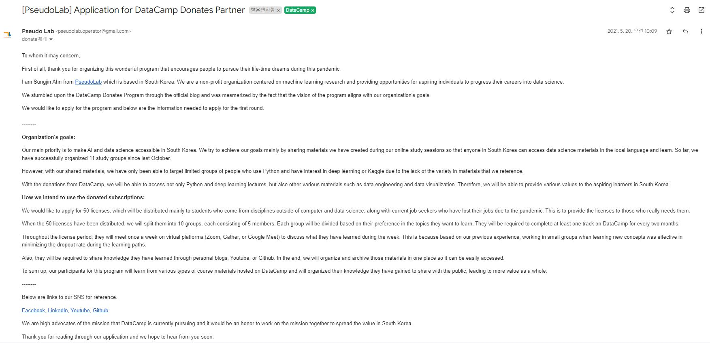
- 처음 지원 당시 발송한 이메일 

지원 메일을 보낸 후에는 안내되는 별도의 지원서 작성 후 DataCamp 측 담당자와 화상 회의를 진행 했습니다. 지원서에는 가짜연구소의 소개, 목적, 활동 내용, 구독권을 사용할 인원 수 등을 기재하였습니다. 또한 화상 회의를 통해 가짜연구소의 미션 및 라이센스를 어떻게 활용할 예정인지에 대한 구체적인 계획을 공유드렸습니다. 그 자리에서 바로 승인 확정이 나서 기분이 정말 좋았던 기억이 있습니다. 

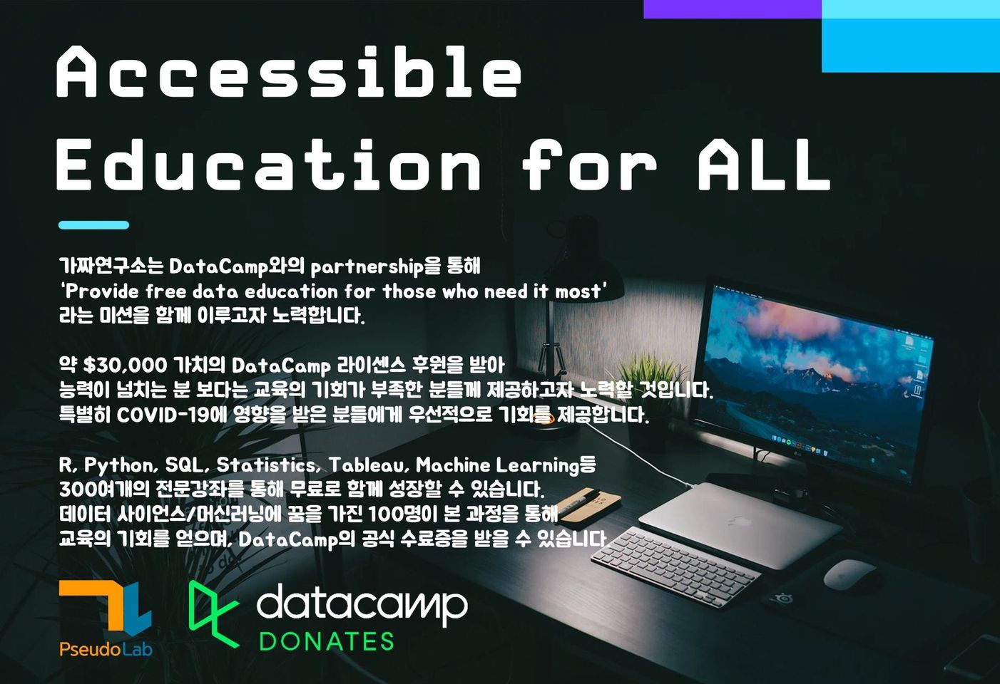
- DataCamp와 파트너쉽 맺은 후 SNS 홍보에 사용된 포스터 

## 21-22 운영 방식
2021년 6월 쯤에 DataCamp와 파트너십을 맺은 후, 제공받은 라이센스를 활용하여 가짜연구소에서 운영하는 Data Science Fellowship 프로그램을 기획했습니다. Fellowship 프로그램을 통해 DataCamp의 라이센스를 데이터 과학 교육이 필요하신 분들에게 분배하고, 해당 학습자 분들께서 스터디를 통해 공동의 목표를 향해 나아갈 수 있도록 도와드리고자 했습니다. 

### 빌더 모집
DataCamp와 라이센스 협의를 할 때 2021년 하반기에는 약 60개만 가지고 운영을 하고, 운영이 원활하게 된다면 2022년 상반기에는 추가로 120개를 더 받아 총 180개를 운영하는 것으로 결정을 했습니다. 그래서 2021년에는 60개의 라이센스를 가지고 Fellowship 프로그램을 운영했습니다. 약 60개의 라이센스를 활용해 10개의 스터디 팀을 만드는 것을 목표로 했습니다.

가장 먼저 스터디를 이끌 빌더(Builder)분들을 2021년 7월에 모집했습니다. [빌더 모집 게시물](https://pseudo-lab.com/DC-Data-Science-Fellowship-1-b3f0f5b5a0014f0f81e0aa5a289ccf9c)을 만들고, 각종 SNS에 해당 게시물을 공유했습니다. 이 과정을 통해 총 11명의 빌더 분들께서 선발 되셨습니다. 

DataCamp에는 400개 이상의 강좌가 있어 여러 강좌들을 엮어서 자유롭게 스터디 커리큘럼 구축도 가능하지만, 해당 강좌들의 개요를 모두 훝어봐야 하는 시간적인 제약이 발생합니다. 그래서 효율성을 고려해서 각각의 빌더 분들께 DataCamp에 있는 Career Track을 바탕으로 스터디를 진행하는 것을 요청드렸습니다. 그 당시에는 총 12개의 Career Track이 존재했고, 각각의 트랙은 특정 직무를 수행 하는데 필요한 강좌들이 엮어 있었습니다. 예를 들어 Data Scientist Python 트랙 같은 경우 Data Scientist 업무를 수행하는데 필요한 개념 및 Python기반 실습 강좌들이 짜여져 있습니다. 각각의 트랙은 약 90~100시간 정도의 분량입니다. Career Track에 대한 자세한 내용은 해당 [홈페이지](https://www.datacamp.com/tracks/career)에서 확인 가능합니다.

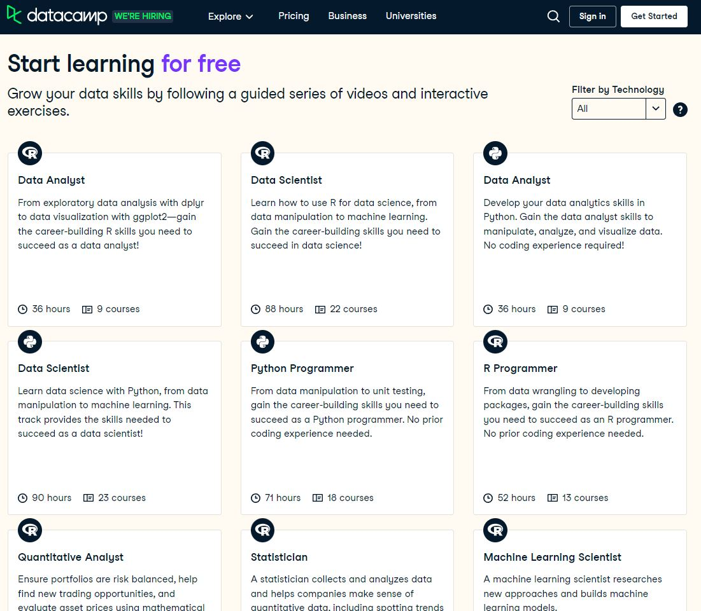
- 다양한 Career Track들

### 러너 모집
빌더 모집이 완료된 후에는 러너 모집을 진행했습니다. 러너 모집은 8월 달에 진행 되었으며, 빌더 모집 과정과 유사하게 먼저 [모집 게시물](https://pseudo-lab.com/DC-Data-Science-Fellowship-1-8-13-a3d8e40f7ec642b7957f219131658c1a)을 작성했고 여러 [SNS 및 채널](https://onoffmix.com/event/242416) 을 통해 홍보를 진행했습니다. 

### 그룹 스터디 운영
스터디 운영에 대한 모든 부분은 전적으로 빌더 분들께서 자율적으로 진행하실 수 있도록 도움드렸습니다. 대신 매월 한 번씩 빌더 분들과 정기 미팅을 하여 각자 어떤 방식으로 스터디를 운영중이신지 공유하실 수 있는 장을 만들었습니다. 이를 통해 스터디 운영에 애로사항이 있으신 분들께서 다른 스터디를 참고해 보실 수 있도록 도와드렸습니다. 또한 미팅 시간에 DataCamp 플랫폼 사용법을 안내드리고, 기능적인 이슈가 있다면 수집해서 DataCamp 담당자 측에 공유드리는 역할을 했습니다. DataCamp 담당자와도 5~6개월에 한번 정도 화상 회의를 진행했기 때문에, 그 회의를 통해서 전달하거나 급한 이슈일 경우 이메일로 즉각 소통을 했습니다. 

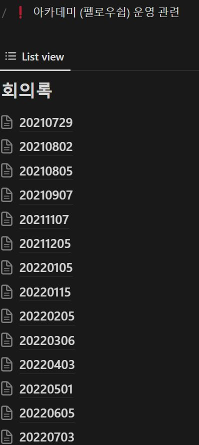
- 빌더 미팅 회의록

DataCamp Donates 프로그램을 지속하기 위해 추적해야 하는 주요 KPI로는 Adoption rate와 Engagement rate이 있었습니다. Adoption rate는 DataCamp 라이센스 이메일을 보냈을 때 수락한 비율을 뜻하며 Engagement rate는 최근 1개월내에 교육을 들은 사용자 수를 바탕으로 산출하는 비율이기 때문에 DataCamp 플랫폼 활용도와 관련된 지표 입니다. 

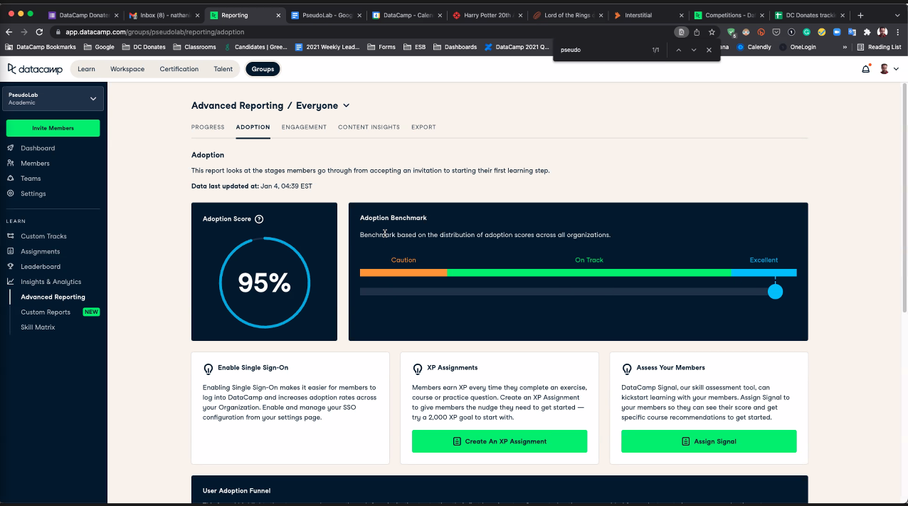
- Adoption rate

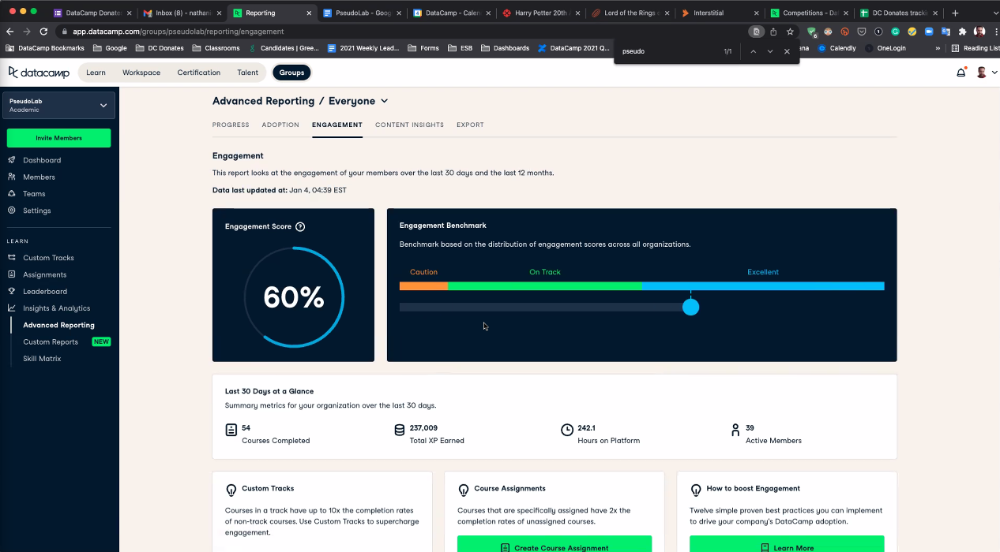
- Engagement rate 

처음 할당 받은 약 60개의 라이센스를 6개월 정도 운용한 후 DataCamp 담당자와 화상 회의로 만나 진행 현황을 공유드렸습니다. 이 회의에서 담당자가 얘기 하길, 가짜연구소의 Adoption rate 및 Engagement rate가 DataCamp Donates에 참가하는 다른 비영리 단체 뿐만 아니라 DataCamp B2B 프로그램에 참가하는 모든 단체와 비교해도 상대적으로 높은 Adoption rate와 Engagement rate를 보인다고 했습니다. 그에 따라 DataCamp Donates 지원 당시 문의 드렸던 120개의 추가 라이센스를 받아 2022년 상반기에는 약 180개의 라이센스를 운용할 수 있게 되었습니다. 

### 개인 스터디 운영
2021년 하반기에 스터디 프로그램을 운영하면서 그룹 스터디 뿐만 아니라 개인 스터디에 대한 수요도 있다는 것을 확인했습니다. DataCamp 상에 있는 400개 이상의 강의를 통해 자체적으로 공부를 하고자 하시는 분들을 위해 개인 스터디 프로그램도 추가로 만들어서 2022년 상반기에 운영했습니다. 180개의 라이센스 중 그룹 스터디에 분배된 라이센스를 제외하고는 모두 개인 스터디로 활용했습니다. 

프로그램 기획 당시 개인 스터디는 혼자 진행하다 보니 그룹 스터디에 비해 상대적으로 스터디의 지속성이 낮을 거라고 판단 되었습니다. 앞서 말씀 드린 것처럼 프로그램 차원에서는 Engagement rate를 일정 수준 유지하는 것이 중요했기 때문에, 개인 스터디 참가자 대상으로는 매월 초에 스터디 기록을 확인해서 전월에 강의 수강 기록이 없을 시 라이센스를 회수하는 조건을 추가 했습니다. 이렇게 회수된 라이센스는 당월 새롭게 모집하는 개인 스터디 참가자 분들에게 재배부 했습니다. 

### 러너 후기
이러한 방식으로 2021년 8월 부터 2022년 7월 까지 1년 동안 Data Science Fellowship을 운영했습니다. DataCamp Donates 프로그램은 선정되면 1년 동안 유효한 라이센스를 받게 됩니다. 2년차에도 재지원을하기 위해 1년차에 참가하신 분들 대상으로 설문조사를 진행했습니다. 180명 이상의 참가자 분들 중 총 33명 께서 응답해주셨으며, 아래는 주요 질문들에 대한 답변입니다. 

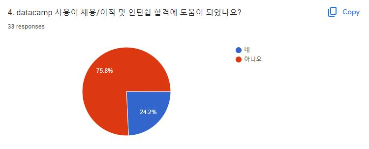

응답자 중 25% 정도가 DataCamp 사용이 채용/이직 및 인턴쉽 합격에 도움 되셨다고 합니다. 채용 및 인턴쉽 선발 과정에는 DataCamp 뿐만 아니라 여러 지식들을 검증하고, 또 여러 요인들이 작용하기 때문이라 생각됩니다.

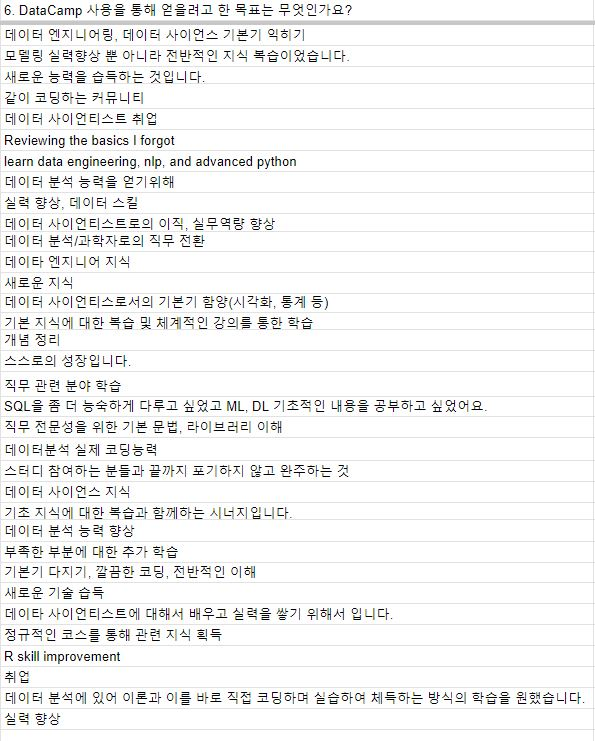
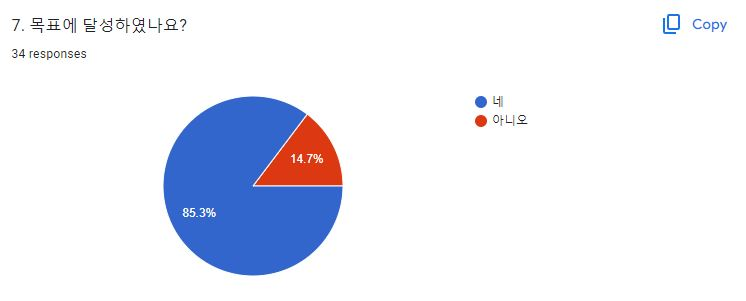
이에 반면 응답자의 약 85%가 개인 목표 달성에는 DataCamp가 도움 되었다고 합니다. 위 표에서 볼 수 있듯이 응답자 분들께서 공유해주신 목표로는 새로운 지식 습득, 기존 데이터 분석 능력 향상 등의 목표들이 있습니다. 

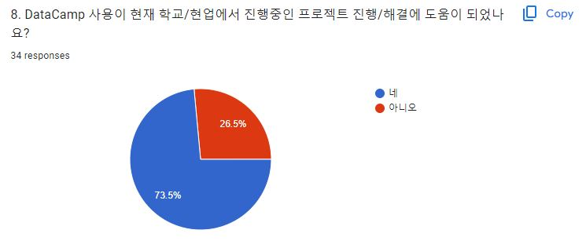
뿐만 아니라 약 73%의 응답자 분들께서 진행 중에 프로젝트에서도 많은 도움에 되었다고 합니다. 진행 하신 프로젝트로는 캐글 대회 참여, 국내 데이터 과학 공모전 참여, 국비 과정 내부 해커톤 참여, 논문 작성 등이 있었습니다. 

본 설문조사로 미루어 보았을 때 취업/이직 및 인턴십 같은 장기적인 목표에는 DataCamp가 직접적인 영향을 주기가 어려울 지라도, 프로젝트 진행 및 개인 목표 달성과 같은 중단기적인 목표에 대해서는 DataCamp가 도움을 준것으로 파악됩니다. 

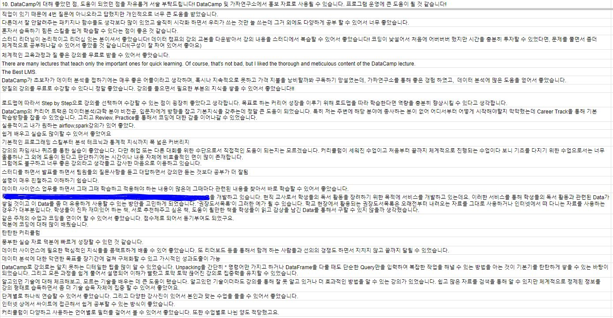

러너 분들이 DataCamp에 대해 좋았던 점들은 위와 같습니다. 커리큘럼이 체계적으로 잘 구성되어 있다는 점, 기초를 다지고 역량을 향상 시키기에는 좋았다는 점 등의 내용이 담겨 있습니다. 

## 22-23 운영 방식
감사하게도 DataCamp Donates 2년차에도 선정이 되어 2022년 8월 부터 2023년 8월 까지 운영할 수 있는 라이센스를 새롭게 받아 Data Science Fellowship 프로그램을 지속해서 운영할 수 있게 됐습니다. 

### 빌더 모집
2년차에는 가짜연구소에서 모집하는 스터디와 함께 모집 방법 및 기간을 통합하여 운영했습니다. 그에 따라 [가짜연구소 5기 스터디 모집](https://pseudo-lab.com/5-e13607f5d5f14ca2a0148817a03388af)할 때 함께 모집이 진행되었습니다.

### 러너 모집
러너 모집 또한 가짜연구소의 [5기 스터디 러너 모집](https://www.facebook.com/groups/pseudolab/posts/793569145213130/) 기간과 통합하여 함께 모집을 진행 했습니다.

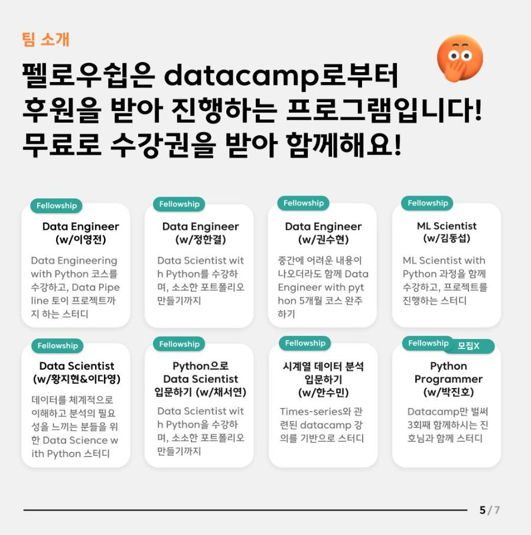
- 가짜연구소 5기 스터디 홍보 포스터 중 일부

### 그룹 스터디 운영
1년차 때와 마찬 가지로 스터디 운영에 대한 부분은 전적으로 스터디 빌더 분들께서 자유롭게 진행하실 수 있도록 도와 드렸습니다. 각 스터디의 성향에 따라 자유롭게 게더타운이나 줌, 혹은 디스코드 회의를 통해 스터디를 진행했고, 진도나 스터디 방식에 있어서도 스터디원들의 상황에 맞게 유동적으로 조정할 수 있도록 했습니다. 

### 개인 스터디 운영
1년차 때는 Engagement rate 지표 관리를 위해 개인 스터디 하시는 분들이 전월 라이센스 이용 기록이 없다면 라이센스를 회수하는 것으로 운영했습니다. 1년차 때 발송한 설문조사에 남겨진 피드백 중에, 라이센스 회수 기준에 경험치 기준을 추가하여 더 도전적으로 만들면 좋을 것 같다는 의견이 있었습니다. 강의를 수강하면 DataCamp 플랫폼에서 정의한 경험치를 받게 되는데, 단순히 전월의 강의 수강 유무만 보는 것이 아니라, 최소 경험치를 추가하는 뜻이였습니다. 그래서 2년차 개인스터디 진행 시에는 전월에 최소 1,000xp 이상 강의를 수강하셔야 라이센스가 유지된다는 조건으로 변경하여 개인 스터디 프로그램을 운영했습니다. 

2022년 말까지는 180개의 라이센스 중 그룹 스터디로 분배된 라이센스를 제외한 라이센스들로 프로그램을 운영해왔습니다. 2023년 상반기부터는 DataCamp측과 논의 후 150개의 라이센스로 조정하여 운영하였습니다.

### 러너 후기 
2023년 8월에 2년차 프로그램이 종료 후 마찬가지로 DataCamp Donates 재지원을 준비하기 위해 설문조사를 실시 했습니다. 24명의 응답자 께서 답변해주셨으며 주요 질문의 답변들은 아래와 같습니다. 

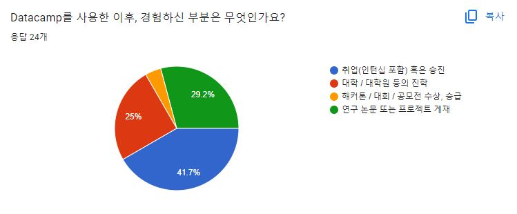

이번 설문에서는 DataCamp를 사용한 이후 약 절반 가량의 응답자분들께서 취업 및 승진을 경험하신 것으로 조사됐습니다. 

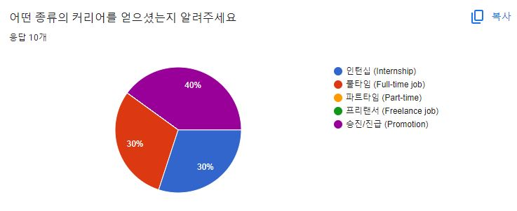

취업 및 승진 하신 분들 중에서는 인턴십, 풀타임 취업, 승진/진급의 결과를 경험하셨습니다. 

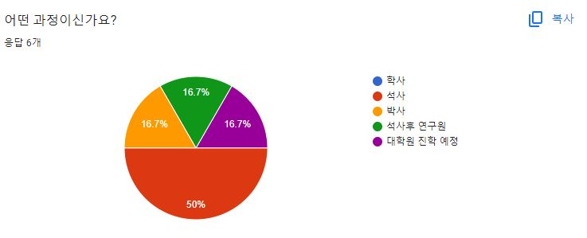

DataCamp 수강 후 학문적 진학을 경험하신 분들 중에서는 석사로 진학을 가장 많이 경험하셨습니다. 

DataCamp를 통해 연구 논문/보고서 작성, 대시보드 구축, 데이터 분석 플랫폼 구축 등 다양한 프로젝트에도 도움이 되신것으로 조사됐습니다. 공개된 프로젝트 중 일부를 소개 드리자면 첫번째로 [DE4E: Data Engineering for Everybody](https://pseudo-lab.github.io/data-engineering-for-everybody/intro.html)가 있겠습니다. 해당 자료는 '모두를 위한 데이터 엔지니어링'이라는 주제의 오픈소스 자료 공유를 목표로 구축된 자료입니다. 본 자료에는 데이터 엔지니어링에 필요한 주제가 누구나 쉽게 이해할 수 있게 정리가 되어있습니다. 설문 응답자 분께서는 Data Engineering with Python 커리어 트랙이 데이터 엔지니어링에 대한 방향과 비전을 명확히 제시해줘서 본 프로젝트에 도움이 많이 되었다고 합니다. 
두번째로는 [Trial-based economic evaluation of the system-integrated activation of community health volunteers in rural Ghana](https://pubmed.ncbi.nlm.nih.gov/37165851/) 논문이 있습니다. 아프리카 가나에서 시행한 아동건강 증진프로그램의 경제성 모델링을 통해 장기효과를 추정하는 연구입니다. 설문 응답자 분께서는 DataCamp의 R프로그래밍 커리어 트랙 커리큘럼 중 시각화 부분이 논문 작성에 도움 되셨다고 하며, 이를 통해 출판가능한 수준의 시각화 기법을 배울 수 있었다고 합니다. 

## 결론
이렇게 해서 이번 블로그 글에서는 가짜연구소의 Data Science Fellowship 프로그램이 어떻게 시작하게 되었고 1년차 및 2년차 프로그램이 어떻게 운영되어 왔는지 공유드렸습니다. 가짜연구소에서 활동하시는 분들은 가짜연구소에서 금전적인 이익을 얻거나 영리적인 결과가 있는 것이 아니고, 자발적으로 틈틈히 시간을 내어 여러 스터디 및 프로그램들을 기획 및 운영 중에 계십니다. 1년차 때는 제 개인적인 시간이 넉넉하여 비교적 많은 시간을 할애 할 수 있었지만, 2년차 때 부터는 개인적인 여건 상 많은 시간을 본 프로그램에 할애 하지 못해 운영을 스스로 기대한 만큼 원활히 하지 못한 점이 아쉬움에 많이 남습니다. 

운영적인 측면에서 많은 지원을 못드렸음에도 불구하고 끝까지 책임감 있게 스터디를 이끌고 완주해주신 모든 Fellowship 빌더 분들께 다시 한번 더 감사의 말씀을 전해드리고 싶습니다. 또한 본 프로그램에 그룹 스터디 또는 개인 스터디로 참여해주신 모든 러너 분들께도 감사의 말씀 드리고 싶고, 각자 원하는 목표를 달성하시는데 본 프로그램이 도움이 되셨기를 바랍니다. 후기 설문조사에 응답해주신 모든 분들에게도 감사드립니다. DataCamp Donates 지원서를 작성할 때 그리고 운영할 때도 많은 도움을 주신 가짜연구소 운영진 및 커뮤니티 빌더 분들께도 감사의 말씀을 전해드리고 싶습니다. 

끝으로 세계적인 교육 플랫폼을 무료로 제공해주신 DataCamp 측, 또한 저희를 DataCamp Donates 프로그램에 선발 해주신 DataCamp 담당자 Nathaniel Taylor-Leach 님께도 큰 감사의 말씀을 전해드리고 싶습니다. 

Thank you DataCamp and Nathaniel!

