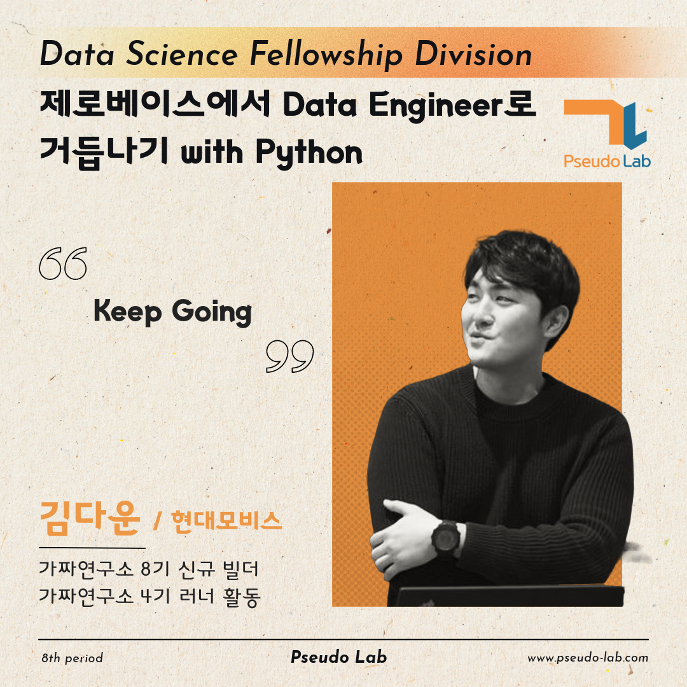

안녕하세요, 저는 "제로베이스에서 Data Engineer로 거듭나기 with Python" 프로젝트를 빌드한 김다운입니다.

이 글에서는 2024년 상반기 제가 진행할 "제로베이스에서 Data Engineer로 거듭나기 with Python" 프로젝트에 대해서 간단히 소개합니다.

## 제로베이스에서 Data Engineer로 거듭나기 with Python 프로젝트 소개

**스터디/프로젝트 내용**

- 9+ 주를 투자하여 한 주에 4시간 혹은 8시간 분량의 강의 및 과제를 하여 Data Engineer가 되는데 필요한 기본적인 지식을 습득하는 스터디 과정을 준비해보았습니다.

**스터디/프로젝트 목적**

- 스터디의 목적은 제로베이스지만 데이터 엔지니어로 커리어를 전환하고자 하거나 관련 지식을 쌓고 싶은데 어떻게 어디서부터 쌓아야 할 지 모르는 사람들을 대상으로 데이터 엔지니어가 알아야 할 기본적인 지식과 툴 들에 대한 전반적인 내용을 하나 하나 쌓아보고자 합니다. 세부 내용은 아래와 같습니다.
  - SQL 학습
  - Python을 이용한 데이터 조작
  - 클라우드 컴퓨팅 환경 이해
  - 데이터 시각화 이해
- 아무래도 초심자를 대상으로 진행하기 때문에 중급 이상이신 분들은 지루할 수 있어요.

**지원 대상**

<aside>

💡 데이터 엔지니어링 분야를 공부하고 싶지만 어디서 부터 해야할 지 모르시는 분!

</aside>

- **프로그래밍**에 대한 기본적인 이해가 꼭 필요해요~!
- **3개월 동안 스터디를 빠지지 않고 꾸준히 참여가 가능하셔야 해요~**
- 주 4시간에서 8시간 강의 수강이 필요하므로 지속 참여가 가능하셔야 합니다.
- 강의는 영어로 진행되므로 해당 강의를 이해하셔야 학습에 무리가 없으세요.
- **데이터 엔지니어링을 처음** 접하시거나 다시 처음부터 공부하고 싶으신 분
- 다른 스터디원의 의견과 사고방식을 존중하면서, 활발하게 Discussion 할 수 있으신 분
- 질문하는데 거리낌이 없으시고 모든 질문에 포용적인 분!!

\*가짜연구소 8기에서 진행되는 프로젝트는 [계획표](https://www.pseudo-lab.com/d16a59aa6f3847a092f8d55b89279b0))를 참고해주세요.

## 빌더 소개

- 안녕하세요. 제로베이스에서 Data Engnieer로 거듭나기 with Python 빌더 김다운입니다.

  현직 자동차 SW개발자이구요. 하염없이 데이터 분야로의 꿈을 키워가다가 결심을 하고 공부를 시작한 초심자입니다. 저도 열심히 학습하려고 빌더를 맡았습니다. 같이 파이팅 해봐요😊

- [Blog](https://downyk.tistory.com/)
- [Github](https://github.com/DownyBehind)
- [LinkedIn](https://www.linkedin.com/in/dawoon-kim-1b530587/)

## 프로젝트 계획

**첫 모임 날짜 & 시간 & 장소**

- 날짜: 3월 5일이 첫모임입니다. 매주 수요일 저녁에 모임을 진행합니다.
- 시간: 오후 10시
- 장소: 온라인 [추후 공지]

정기 **모임 시간 & 장소**

- 시간: 매주 수요일 오후 10시
- 장소: 온라인 [추후 공지]

**학습 방법**

- 기본적으로 DataCamp 강의를 따라 진행합니다.
- [강의소개](https://app.datacamp.com/learn/career-tracks/data-engineer) 참조하세요!

## 주차별 목표

프로젝트 계획에서 소개드린 것과 같이 3월 5일부터 매주 수요일에 스터디를 합니다.

매 스터디 전에는 아래와 같이 DataCamp 내에 Data Enginner Certificate 과정에 있는 강의를 2개씩 수강하고 리뷰하셔서 오셔야 합니다.

각 주차 별로 발표자를 한 명 혹은 두 명을 선정해서 진행할 예정입니다.

혹시 특정 일자에 스터디가 부득이하게 불가할 경우를 제외하고는 일정대로 진행하고자 합니다.

**주차별 목표**

- OT (스터디 소개/방향 논의, Ice Breaking)

- Ch 1. Understanding Data Engineering, Ch 2. Introduction to SQL

- Ch 3. Intermediate SQL, Ch 4. Joining Data in SQL

- Ch 5. Introduction to Relational Databases in SQL, Ch 6. Database Design

- Ch 7. Introduction to Python, Ch 8. Intermediate Python

- Ch 9. Introduction to Importing Data in Python, Ch 10. Intermediate Importing Data in Python

- Ch 11. Understanding Cloud Computing, Ch 12. Cleaning Data in Python

- Ch 13. Writing Efficient Python Code, Ch 14. Streamlined Data Ingestion with pandas
- Ch 15. Cleaning Bank Marketing Campaign Data, Ch 16. Understanding Data Visualization

- Ch 17. Introduction to Git, Ch 18. Software Engineering Principles in Python

- 회고 및 최종 리뷰
