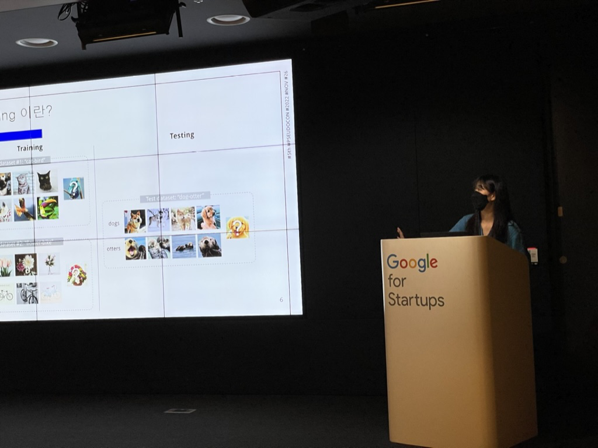
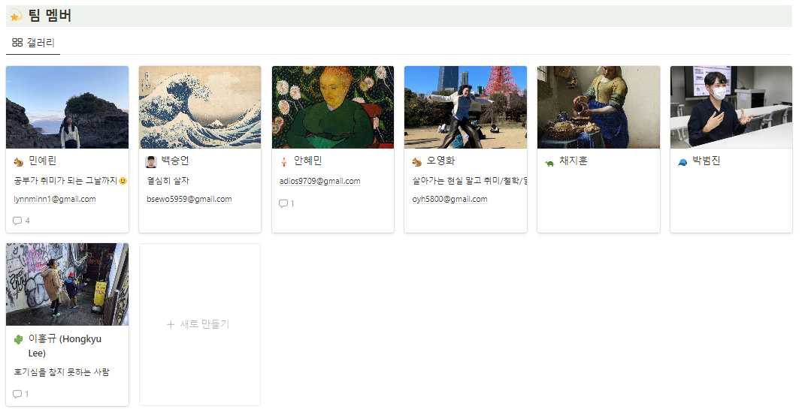

안녕하세요, 모여봐요 강화학숲 프로젝트 빌더 [민예린](www.linkedin.com/in/yerinmin)입니다:)

저희는 가짜연구소 리서치팀이고, 2022년 9월에 시작하여 5 ~ 8기에 걸쳐 스터디 모임을 이어오고 있습니다. Meta Learning, Model based RL, Graph까지 여러 주제에 대해 공부하고 있고, 기수마다 논의를 통해 즐겁게 공부할 수 있는 스터디 주제를 함께 잡아가고 있습니다! 
5기부터 항상 함께 해주시는 (1) 스스로 동기부여를 잘 하시고 (2) 책임감이 있는 좋은 분들 덕분에 8기까지 시작하게 되어 정말 기쁩니다!

>👋 5기 스터디 : [멀티태스크/메타러닝 초읽기](https://www.notion.so/d28fb9498cc74b1ca7c7f91eba42ec5f?pvs=21)  
>👋 6기 스터디 : [멀티태스크/메타러닝 초읽기 & Model based RL](https://www.notion.so/Model-based-RL-a5aac67188164a04aa22fe23478228d1?pvs=21)   
>👋 multi-task and meta learning [git book 링크](https://pseudo-lab.github.io/Deep-Multi-Task-and-Meta-Learning/intro.html)  
>👋 7기 스터디 : [Graph 이해하기](https://www.notion.so/Graph-7303268b64f049c89f792ec443de5dae?pvs=21)

오늘 글에서는 그 중 8기인(24년 상반기 진행) '모여봐요 강화학숲' 스터디에 대해 소개드리려고 합니다!

 

## 모여봐요 강화학숲 프로젝트 소개
저희 스터디는 이름에서 알 수 있듯 다함께 모여서 강화학습에 대한 즐거운 대화를 이어가는 스터디입니다 :) 저희 내부적으로는 강화학습 취미반이라고도 하고 있어요!  
강화학습을 하는 분들도 많지 않고, 시행착오를 나눌 수 있는 모임은 더더욱 적어요! 그래서 저희는 강화학습 연구자들끼리 모여서 힘들었던 일, 뿌듯했던 연구 등을 나누며 수다를 떨 수 있는 자리를 만들고 있습니다 :)

앞전 스터디에서는 특정 주제(model based rl, meta rl, continual rl)에 대해 공부했다면 이번에는 더욱 취미반에 부합하도록 **정해진 커리큘럼 없이 매주 2개의 논문 리뷰로 진행됩니다.**  
각자 그동안 보고싶었으나 볼 시간이 없었던 논문들을 5개씩 취합하고 (총 35개) 매주 랜덤하게 선택해 논문 리뷰를 진행합니다. 덕분에 offline rl, representation learning 관련 rl 테크닉, algorithm, mutitask-learning 등 굉장히 다양한 분야의 rl 논문을 볼 수 있어서 벌써부터 마음이 두근두근 하네요 ㅎㅎ

*가짜연구소 8기에서 진행되는 프로젝트는 [계획표](https://pseudo-lab.com/chanrankim/e4d5b23a28ab43eba97dfd71f8d92bb9)를 참고해주세요.

 

## 빌더 소개
저는 강화학습을 메인으로 연구하고 있는 [민예린](www.linkedin.com/in/yerinmin)입니다.
공부해야 할 것들은 너무 많은데 이왕이면 사람들과 함께 즐겁게 하고 싶어서 가짜연구소에 참여하게 되었습니다:)  
가끔 의지는 넘치지만 실행력이 부족할 때, 또는 내 빠른 실행력을 누군가와 나누고 싶을 때 스터디원분들과 모여서 서로 응원도 하고 박수도 쳐주는 그런 스터디를 진행하고 싶고 또 진행하려고 노력하고 있습니다!

아래는 예전 수도콘 발표 이미지인데, 자랑스러워서 한 번 넣어봤습니다!

## 프로젝트 계획
8기 시작 전 취합한 논문들입니다.
OT날 (3월 5일 화요일 오후 10시) 사다리 타기를 통해 발표자를 선정한 후, 2주치 논문을 랜덤하게 선택할 예정입니다 :)  
내가 넣어 놓은 어려운 논문에 본인이 걸릴 수도 있어요!!!

- [BIRD: Generalizable Backdoor Detection and Removal for Deep Reinforcement Learning](https://openreview.net/pdf?id=l3yxZS3QdT)
- [Learning to Discover Skills through Guidance](https://openreview.net/pdf?id=IUGwUr5_9wY)
- [SMACv2: An Improved Benchmark for Cooperative Multi-Agent Reinforcement Learning](https://arxiv.org/pdf/2212.07489.pdf)
- [Contrastive Modules with Temporal Attention for Multi-Task Reinforcement Learning](https://arxiv.org/pdf/2311.01075.pdf)
- [Beyond Uniform Sampling: Offline Reinforcement Learning with Imbalanced Datasets](https://openreview.net/pdf?id=TW99HrZCJU)
- [LEARNING TO ADAPT IN DYNAMIC, REAL-WORLD ENVIRONMENTS THROUGH META-REINFORCEMENT LEARNING](https://openreview.net/pdf?id=HyztsoC5Y7)
- [Solving Dynamic Graph Problems With Multi-Attention Deep RL](https://arxiv.org/pdf/2201.04895.pdf)
- [Offline Actor-Critic Reinforcement Learning Scales to Large Models](https://arxiv.org/pdf/2402.05546.pdf)
- [SafeDreamer](https://arxiv.org/pdf/2307.07176.pdf)
- [Suphx: Mastering Mahjong with Deep Reinforcement Learning](https://arxiv.org/pdf/2003.13590.pdf)
- [Attacking Fake News Detectors via Manipulating News Social Engagement](https://arxiv.org/pdf/2302.07363.pdf)
- [Uncertainty-Aware Reward-based Deep Reinforcement Learning for Intent Analysis of Social Media Information](https://arxiv.org/pdf/2302.10195.pdf)
- [CLARE: A Semi-supervised Community Detection Algorithm](https://arxiv.org/abs/2210.08274)
- [Application of Deep Reinforcement Learning to Payment Fraud](https://arxiv.org/pdf/2112.04236.pdf)
- [Deceptive Path Planning via Reinforcement Learning with Graph Neural Networks](https://arxiv.org/pdf/2402.06552.pdf)
- [Efficient Planning with Latent Diffusion](https://arxiv.org/pdf/2310.00311.pdf)
- [Training Diffusion Models with Reinforcement Learning](https://arxiv.org/pdf/2305.13301.pdf)
- [Reasoning with Latent Diffusion in Offline Reinforcement Learning](https://openreview.net/pdf?id=tGQirjzddO)
- [RLIF: Interactive Imitation Learning as Reinforcement Learning](https://openreview.net/pdf?id=oLLZhbBSOU)
- [Stabilizing Contrastive RL: Techniques for Robotic Goal Reaching from Offline Data](https://openreview.net/pdf?id=4Xsa03f9jR)
- [Project and Probe: Sample-Efficient Adaptation by Interpolating Orthogonal Features](https://openreview.net/pdf?id=rcFkYXmhAR)
- [Mixtures of Experts Unlock Parameter Scaling for Deep RL](https://arxiv.org/pdf/2402.08609.pdf)
- [Retrieval-augmented reinforcement learning](https://arxiv.org/pdf/2202.08417.pdf)
- [Large-scale retrieval for reinforcement learning](https://proceedings.neurips.cc/paper_files/paper/2022/file/7eca17ef54789b0663cab421f2e9dbf5-Supplemental-Conference.pdf)
- [Don't throw away your value model! Making PPO even better via Value-Guided Monte-Carlo Tree Search decoding](https://arxiv.org/pdf/2309.15028.pdf)
- [The primacy bias in deep reinforcement learning](https://arxiv.org/pdf/2205.07802.pdf)
- [REWARD DESIGN WITH LANGUAGE MODELS](https://arxiv.org/pdf/2303.00001.pdf)
- [When Does Self-Supervision Help Graph Convolutional Networks?](https://arxiv.org/pdf/2006.09136.pdf)
- [OFFLINE RL WITH NO OOD ACTIONS: IN-SAMPLE LEARNING VIA IMPLICIT VALUE REGULARIZATION](https://arxiv.org/pdf/2303.15810.pdf)
- [Offline Multi-Agent Reinforcement Learning with Implicit Global-to-Local Value Regularization](https://arxiv.org/pdf/2307.11620.pdf)
- [LEARNING INVARIANT REPRESENTATIONS FOR REINFORCEMENT LEARNING WITHOUT RECONSTRUCTION](https://openreview.net/pdf?id=-2FCwDKRREu)
- [Deep Reinforcement Learning with Plasticity Injection](https://openreview.net/attachment?id=jucDLW6G9l&name=pdf)
- [Explaining Reinforcement Learning with Shapley Values](https://proceedings.mlr.press/v202/beechey23a/beechey23a.pdf)
- [IMPALA: Scalable Distributed Deep-RL with Importance Weighted Actor-Learner Architectures](https://arxiv.org/pdf/1802.01561.pdf)
- [Grandmaster-Level Chess Without Search](https://arxiv.org/pdf/2402.04494.pdf)

 

## 주차별 목표
첫 모임은 3월 5일 (화) 오후 10시이며, 6월 25일(화)까지 **매주 화요일 오후 10시 가짜연구소 디스코드**에서 진행됩니다.
자세한 일정은 [계획표](https://pseudo-lab.com/chanrankim/e4d5b23a28ab43eba97dfd71f8d92bb9) 맨 하단을 참고해주세요!  
중간 & 마지막에 오프라인 모임도 진행될 예정입니다. 오프라인 모임 때는 모여서 스터디 진행 후 함께 저녁을 먹으며 근황을 나누는데요, 청강분들도 참여하셔서 같이 모임하기 때문에 **'누구든' 온&오프라인 청강이 가능합니다!!**

마지막까지 글 읽어주셔서 감사합니다:)  
자랑스러운 저희 팀원분들을 소개드리면서 마치겠습니다!

