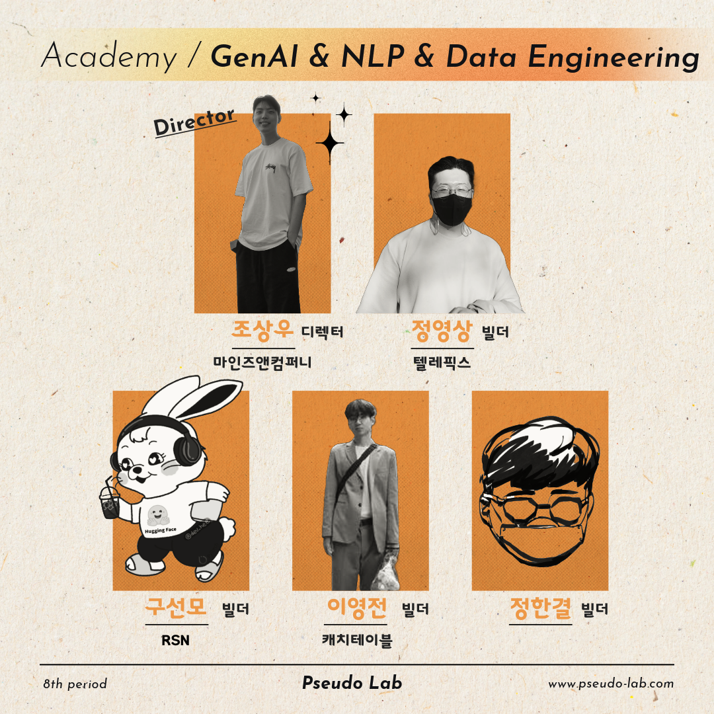
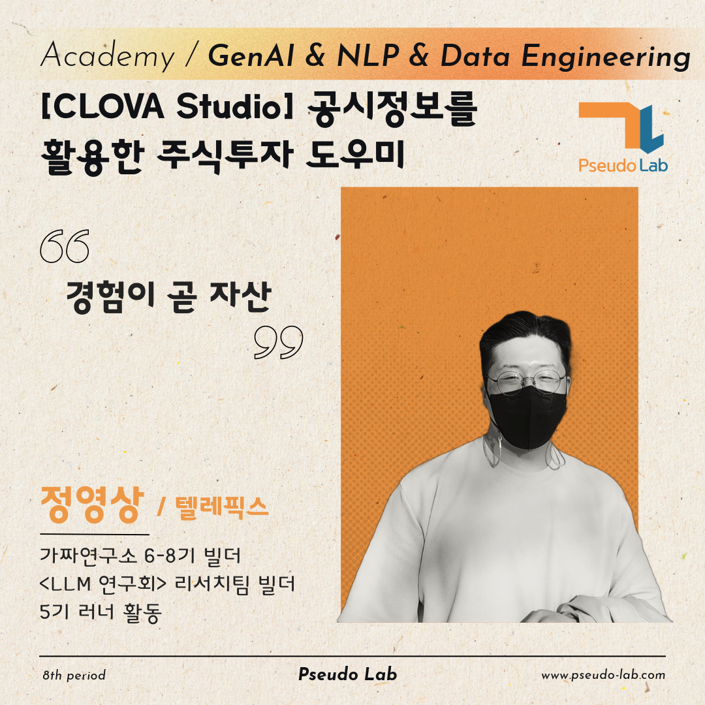

안녕하세요~! 😀\
저는 가짜연구소 8기 프로젝트 "[CLOVA Studio] 공시정보를 활용한 주식투자 도우미"의 빌더 정영상입니다.\
이번 포스트에서는 2024년 상반기에 진행할 프로젝트에 대해 간단히 소개하고자 합니다!

---

## 📈[CLOVA Studio] 공시정보를 활용한 주식투자 도우미 프로젝트 소개

### 프로젝트 내용

- 저희 프로젝트는 **전자공시시스템으로부터 제공받은 공시정보와 기타 금융 관련 정보들을 토대로 투자를 도와주는 챗봇**을 **LLM**으로 제작하는 프로젝트입니다.

  - 먼저, 전자공시시스템(DART)이란, 상장법인 등이 공시서류를 인터넷으로 제출하고, 투자자 등 이용자는 제출 즉시 인터넷을 통해 조회할 수 있도록 하는 종합적 기업공시 시스템인데요, DART로부터 API를 통해 해당 자료들을 제공받을 수 있습니다.

  - [전자공시시스템(DART) 오픈API](https://opendart.fss.or.kr/intro/main.do)을 통해 어떤 데이터를 제공받을 수 있을지 확인하실 수 있습니다.

  - 또한, 주식 투자에 영향을 미치는 기업 관련 뉴스데이터들을 수집 및 요약하여 챗봇의 답변에 활용할 수 있습니다.

- 이 프로젝트는 **[가짜연구소 X 네이버 클라우드 / 네이버 그린 디벨로퍼스 예비 개발자 지원 프로그램]** 의 일환으로, 네이버클라우드로부터 크레딧을 지원받아 진행되는 프로젝트입니다.

  - 가입 크레딧(10만) + 1차 지원 크레딧(20만) + 2차 지원 크레딧(70만) = **총 100만 크레딧**을 지원받아 프로젝트를 진행하게 됩니다.

  - 아래 링크들은 네이버클라우드 활용 사례입니다.
    - [312 포텐데이X클로바 스튜디오](https://www.notion.so/312-X-47e0fdd05fa6490194685ec8c4ff7e76?pvs=21)

    - [[행사 스케치] 10일 만에 만든 생성형 AI 서비스 퀄리티는 어떨까? | 312 포텐데이 with 클로바 스튜디오 시상식🏆](https://blog.naver.com/n_cloudplatform/223323693990)

### 프로젝트 목적

- **주식투자를 해보긴 했으나 매번 확신을 가지고 투자하지 못하는 초보자들을 위해 챗봇을 제작**하고자 합니다.

- 이에 본 프로젝트에서는 투자 초보자들에게 공시정보를 통해 얻은 투자지표와 산업 트렌드, 호악재 보도 등을 통해 종합적으로 투자 여부를 판단할 수 있도록 방향을 제시하고자 합니다.

- 투자 조언에 대한 근거는 기업의 공시정보와 관련 보도자료를 통해 종합적으로 도출됩니다.

- 전체 프로젝트 개발은 [네이버클라우드](https://www.ncloud.com/product)로부터 제공되는 서비스를 통해 진행되며, 서비스 이용 요금은 지원받은 크레딧을 사용할 예정입니다.

### 프로젝트 기간

- 총 3개월간 진행합니다.
    - 약 4주 간 챗봇에 대한 기획 진행

    - 약 6주 간 기획 내용대로 개발 및 테스트

    - 이후 2주 간 보수 및 개선

- 자세한 일정은 아래 **주차별 목표**를 확인해주세요.

 *가짜연구소 8기에서 진행되는 모든 프로젝트는 [계획표](https://www.pseudo-lab.com/d16a59aa6f3847a092f8d55b89279b0)를 참고해주세요.

---

## 🤪 빌더 소개

|  |  |
| --- | --- |

- 저는 현재 인공위성 스타트업에서 NLP Researcher로 재직중인 빌더 정영상입니다.

- 자세한 소개는 [소개링크](https://www.notion.so/chanrankim/55fb8e133617485682f3656ea5b57fad?pvs=4)를 통해 인사드립니다.
  
  - [Github](https://github.com/videorighter)
  
  - [LinkedIn](https://www.linkedin.com/in/video-jeong/)

- 가짜연구소 활동

    | 활동명 | 기수 | 역할 | 기간 |
    | --- | --- | --- | --- |
    | [Vision Transformer의 모든 것](https://www.notion.so/Vision-Transformer-7cd4fbe829854c40b4a5dba3e51b10f8?pvs=21)  | 5기 | 러너 | 2022.09 ~ 2022.11 |
    | [PseudoChat Dataset 구축 프로젝트](https://www.notion.so/PseudoChat-Dataset-0958bb033bc84076bc1aa2091eb2770d?pvs=21)  | 6, 7기 | 빌더 | 2023.03 ~ 2023.11 |
    | [LLMs 연구회](https://www.notion.so/LLMs-5a96fe44ddff4fd7afe94c6d47b7c07b?pvs=21)  | 7, 8기 | 리더 | 2023.09 ~ |
    | [[CLOVA Studio] 공시정보를 활용한 주식투자 도우미](https://www.notion.so/chanrankim/CLOVA-Studio-922d8cee46a34747a241ac9d871fe57d?pvs=4)  | 8기 | 빌더 | 2024.03 ~ |

---

## 📋 프로젝트 계획

### 첫 모임 날짜 & 시간 & 장소

첫 모임은 OT입니다.\
간단하게 프로젝트를 소개하고 방향을 논의합니다.\
간단하게 자기 소개를 하면서 Ice breaking을 할 예정입니다.

- 날짜: 3월 5일 화요일이 첫모임입니다. 매주 화요일 저녁에 모임을 진행합니다.

- 시간: 오후 9시

- 장소: 디스코드 또는 구글밋

### 모임 시간 & 장소

- 시간: 매주 화요일 오후 8시 ~ 10시 유기적으로 진행합니다.

- 장소: 디스코드 또는 구글밋

### 기타사항
- 크레딧을 지원받아 진행하는 프로젝트 특성상 프로젝트 내용이 블로그 등을 통해 공개될 수 있습니다.
- 자세한 사항은 프로젝트를 진행하면서 천천히 공유하도록 하겠습니다!
- 추가 문의사항은 디스코드 또는 메일(videorighter@gmail.com)을 통해 문의해주시면 감사하겠습니다.

## 🗓 주차별 목표

프로젝트는 참여자의 기획 및 의도에 따라 진행하지만, 모든 모임은 원칙적으로 청강이 가능합니다.\
또한, 서비스가 가능한 프로젝트를 지양하지만 개인 사정으로 인한 일정 변동이 있을 수 있는 점 참고 부탁드립니다.

OT - (프로젝트 소개/방향 논의, Ice Breaking)

### 기획 - 4주 간 주차 별 필수 진행이 아닌 유기적으로 진행

Week 1 - [**문제 및 요구사항 정의** - 금융 관련 고객 니즈 파악 및 주식 투자 방식 탐색](https://www.notion.so/4ac5b309eae0415c8001d4a103f4514d?pvs=21)

Week 2 - [공시정보 및 주식 관련 정보 API 탐색](https://www.notion.so/API-f0cdb8f9432c42a6b0e771aafe3e3e74?pvs=21)

Week 3 - [제공 크레딧 활용 인프라 테스트(NAVER CLOUD, CLOVA Studio 테스트 등)](https://www.notion.so/NAVER-CLOUD-CLOVA-Studio-1ac948ff847745c19658523299f71d84?pvs=21)

Week 4 - [프로토타이핑 - 전체 아키텍쳐 설계 및 유저 플로우 설계](https://www.notion.so/ec3e57c49fb14f98957e4506d3e4586a?pvs=21)

### 개발 - 6주 간 프로젝트 설계에 따른 기능 개발(유기적 진행)

Week 5 - [공시정보를 통한 투자 지수 계산 기능 개발](https://www.notion.so/de9b7e10bdd64ede9677c5b95d094037?pvs=21)

Week 6 - [관련 기사 수집 및 요약 기능 개발](https://www.notion.so/50d09eebd48b42c4928fd4650dbe2a59?pvs=21)

Week 7 - [답변 일관성을 위한 프롬프트 엔지니어링](https://www.notion.so/694c8568be73434ba064cce4cb509b35?pvs=21)

Week 8 - [중간 리뷰 타임](https://www.notion.so/0454c7e1e39b42969807ebe28f009f8d?pvs=21)

Week 9 - [투자 트렌드 분석 기능 개발](https://www.notion.so/2f35f052b6c341168f2e618924f1eb13?pvs=21)

Week 10 - [제반 기능 종합 및 테스트](https://www.notion.so/623f273aa2b34fb99772c1a1cb2ae3de?pvs=21)

Week 11 - [전체 기능 검토, 문서화 및 배포](https://www.notion.so/1990d3ae7b444e2a92008a5f370ca5b6?pvs=21)

### 고도화 - 2주 간 배포 이후의 피드백을 통한 개선

Week 12 - [피드백 반영 및 프롬프트 엔지니어링 수정 등의 기능 개선](https://www.notion.so/bf46a492cc15416fa9c4cb4f6e62c496?pvs=21)

Week 13 - [고도화 결과 정리 및 문서화](https://www.notion.so/9cc72dffcf9643f6b4969ebd33433101?pvs=21)

Week 14 - [회고 및 최종 리뷰](https://www.notion.so/ac5ff75300df4218abbbf4cdfe9462a3?pvs=21)

---
