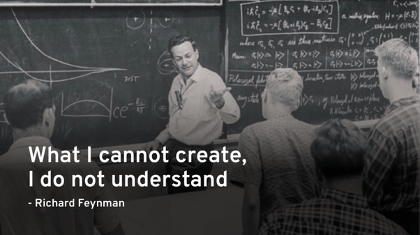
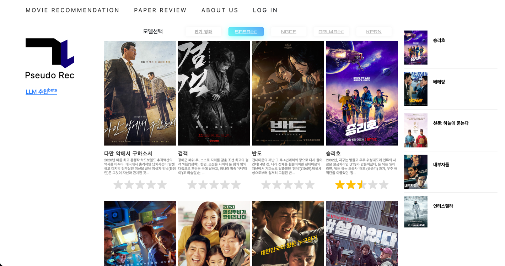

# 추천시스템 논문에서 서비스까지 2를 시작하며

안녕하세요! 저는 가짜연구소 5기부터 8기까지 활동 중인 이경찬이라고 합니다. '추천시스템 논문에서 서비스까지2' 스터디의 빌더로서, 8기를 시작하며 목표를 한번 더 상기하고 어떤식으로 진행할지에 대한 글을 작성해보고자 합니다.

지난 6기에서 '추천시스템 주요 논문 리뷰 및 구현' 스터디를 진행한적이 있습니다. 그 때 논문을 리뷰하면서 다음과 같은 욕심이 자연스럽게 생겼습니다.

“오프라인 성능보다는 실제 아이템의 추천 결과를 모델별로 비교하는 사이트가 있다면 좋겠다”

“추천 서비스를 일반인 대상으로 실제로 운영하는 A to Z의 경험을 쌓고싶다"

"추천시스템 관련된 논문 리뷰와 트렌드 자료를 정리해서 모두에게 공개함으로써 추천시스템을 공부하는 분들이 한 번쯤 접속할 수밖에 없는 사이트를 만들고싶다”

'추천시스템 논문에서 서비스까지' 스터디는 위 욕심들을 채우기 위해 시작하게 되었습니다. 추천시스템을 공부하고 좋아하는 분들이 많은데, 막상 NLP나 강화학습처럼 자료가 한 데에 모인 곳은 많이 없더라구요. 아무튼 7기부터 호기롭게 만들기 시작했습니다!

# 목표

"추천 모델을 이해했다면, 실제로 서비스 해본다"라는 목표를 갖고있습니다. 파인만 선생님은 말씀하셨습니다. "만들지 못한다면 이해하지 못한 것이다"라고요! 이해했다면 만들어봐야죠!

이번 스터디는 7기부터 시작한 '추천시스템 논문에서 서비스까지' 스터디의 2번째 시리즈로, 이전 스터디에서 진행하던 추천서비스 웹페이지 구현을 이어나갑니다. 위에서 언급한 바램들을 직접 부딪혀가며 모르면 찾아보고, 적용하고, 개선하는 방식으로 진행합니다.

기본적으로, '추천모델 논문 -> 구현 -> 오프라인 평가 -> 서비스 배포 -> 온라인 평가/성능 비교(A/B테스트 등) -> 개선'의 사이클을 경험해보는 것이 목표입니다.

글을 쓰는 현시점에는 전체 사이클의 playground가 될 웹페이지 구현, 주요 추천모델(CF, SASRec, NGCF, KPRN 등) 배포 단계에 있다고 할 수 있겠습니다! 본래 7기가 마무리되기 전에 구글검색에 저희 페이지가 뜨도록 하는 것이 목표였는데 시간이 참 빠르네요..😂

# 계획

지금까지 진행된, 그리고 앞으로 진행할 사항은 다음과 같습니다.

### 진행상황

현시점까지 구현된 정도는 위 이미지처럼 영화추천 메뉴, 포스팅 메뉴, 모델별 추천결과 선택 등이 있습니다. [www.pseudorec.com](www.pseudorec.com이)이라는 멋진 도메인도 구입해놓았습니다 😁

웹페이지에는 Django, Docker, Kafka, AWS(서버, 데이터베이스) 등으로 구성되어있습니다. 이러한 스택의 활용 경험을 쌓는 것 또한 중요하게 생각하고 있습니다.

또한 LLM 추천을 위한 자료조사를 진행중입니다. 예를 들면 '범죄도시2와 비슷한 영화 추천해줘'라는지, '봉준호 감독 영화 추천해줘'라는 질문에 영화를 추천하는 것이 목표입니다!

### To Do

7기때 학습에 쓰일 데이터는 크롤링을 마쳤습니다. 바로 영화 평점 데이터입니다. 어디서 수집했는지는 아직 비밀... 이번 스터디의 계획은 크게 다음과 같이 나눌 수 있습니다.

1. 다양한 추천 모델 구현

    - 전통적인 추천 기법부터 SOTA 모델까지 다양하게 구현
    - 이들의 실제 추천 결과를 비교해보고 다양한 실험 & 버저닝 진행    

2. LLM 추천 구현(hot!)
   
    - LLM이 추천에 빠질수 없음
    - RAG, Langchain을 활용하여 멋진 영화 추천 서비스를 만들어보자

3. MLOps 적용

    - 배포 자동화, 쿠버네티스, 로그 저장 및 배치학습 자동화
    - 아직 안해봐서 자세히 모름
    - 근데 하고싶다!

4. A/B 테스트

    - 추천 결과를 실제로 사용자에게 보여주고, 성능을 비교해보자
    - 이를 통해 사용자의 반응을 확인하고, 개선점을 찾아보자

5. 사용자 편의 중심 웹페이지 개선 & 구글 검색 노출되기

   - 일반인도 쉽게 사용할 수 있는 웹페이지로 개선
   - 예를 들면 마이페이지, 댓글기능, 검색기능 등
   - 구글 검색에 노출되기 위한 홍보작업

추가적으로, 한달마다 '월간슈도렉'이라는 이름으로 최신 트렌드 또는 추천시스템 관련 주제의 인사이트를 담은 글을 작성할 계획입니다.

# 자 이제 시작이야

현재도 팀원 모두가 각자 공부하고싶은 것을 열렬히 공부하고 구현하며 성장하고 계십니다. 새로 합류하실 분들과 함께 이번 8기에도 많이 성장했으면 좋겠습니다. 저희 스터디에 대한 많은 관심과 응원 부탁드립니다! 감사합니다.