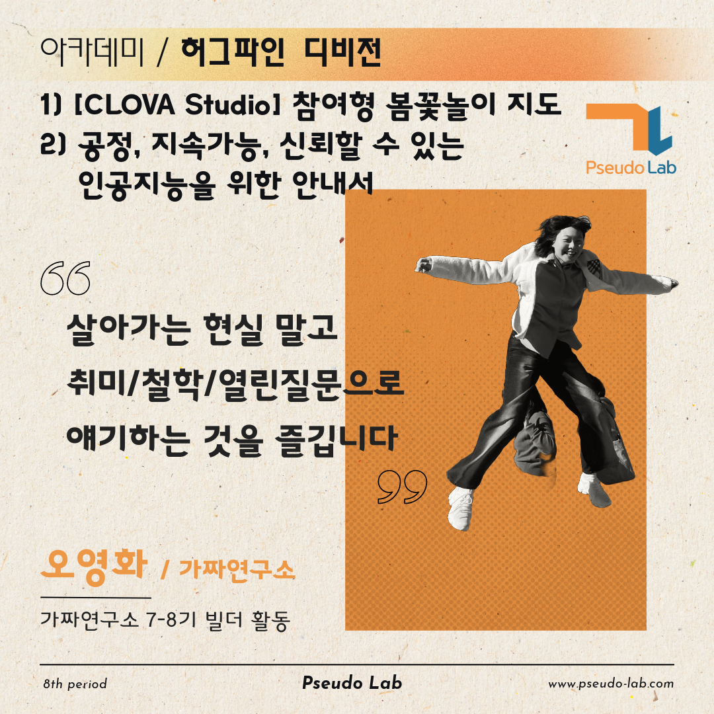

안녕하세요, 공정하고 지속가능하며 신뢰가능한 인공지능 안내서 아카데미 빌더 [오영화](www.linkedin.com/in/younghwa5)입니다!

이번 글에서는 2024년 상반기에 공정하고 신뢰가능하고 지속가능한 생성형 AI를 공부하는 스터디에 대해 소개하려고 합니다!

 

## [공정하고 지속가능하며 신뢰가능한 인공지능을 위한 안내서] 소개

### 스터디/프로젝트 내용

저희 스터디는 긴 제목에서 알 수 있듯 **공정한 AI, AI를 지속가능하게 다룰려면, AI를 신뢰가능하도록 어떤 기법들이 연구되고 있는지**를 공부하고 정리해서 **대중에게 소개하는** `안내서`를 만들어가는 스터디입니다 :) 

2019년 OECD에서 [AI Principles](https://oecd.ai/en/ai-principles)을 공표하면서 인권을 존중하는 책임감있는(trustworthy) 인공지능의 중요성이 대두되었습니다. 

최근 생성형 AI가 폭발적으로 성장하면서 LLM의 프롬프트를 통한 기밀정보 유출, 편파적인 그림 생성 등의 문제점도 같이 생겨나고 있습니다. 

이런 인공지능이 다시 책임감있게 사용될 수 있도록, 데이터의 편향이 적고, 기후위기에 대처할 수 있으며, 생성형 인공지능의 보안에 대한 연구와 가이드라인에 대한 필요성을 논의하고자 합니다. 

### 스터디/프로젝트 목적
1. AI's fairness, Sustainable AI, Trustworthy AI에 대한 기본적인 개념 학습
2. 공정한, 지속 가능한, 신뢰할 수 있는 AI에 대한 설명서(글, 영상, 포스트) 작성
3.  프로젝트를 통해 기존 생성형 AI에 공정성, 지속 가능성, 신뢰성을 적용

위 세개의 목적을 순환적으로 이루면서 새롭게 개발되는 인공지능 모델이, 데이터셋이, 방법론이 공정한지, 지속가능한지, 신뢰할 수 있는지를 판단하는 눈을 기르고, 그 중요성을 설득하고자 합니다. 
 

## 빌더 소개
저는 대중에게 AI 서비스를 전달하고 싶은 오영화입니다.

지식의 성장뿐 아니라 사람들과 함께 성장하는 가짜연구소의 이념에 반해 참여했다가 열정적인 사람들의 좋은 자극을 받으며 꾸준히 활동하고 있습니다!  
새로운 분야를 공부하고 싶고, 읽어야할 자료가 쌓여가는데 시도하고자 하는 의지가 1% 부족할 때, 같은 시간을 공유하는 사람과 스터디 결과를 기다리는 대중을 생각하며 헤쳐나가고 서로를 응원하는 스터디가 진행될 수 있도록 노력하고 있습니다. 

- [LinkedIn](www.linkedin.com/in/younghwa5)

## 프로젝트 계획
첫 모임은 3월 5일 (화) 오후 8시 반이며, 6월 11일(화)까지 **매주 화요일 오후 8시 가짜연구소 디스코드**에서 진행됩니다.

매 스터디 때는 최소 1명~최대 3명이 20분간 발표, 5분~10분간 의견 교류(QnA, 감상평)을 진행하여 총 스터디 시간이 1시간 30분이 넘지 않는 알차고 밀도있는 시간을 보내고자 합니다. 

아래의 자료들을 레퍼런스 삼아 좀 더 적은 양의 내용이 담긴 현대인의 컨텐츠로 만들어 개념에 대한 접근성을 높이고자 합니다

- [Trustworthy AI : From Principles to Practices](https://arxiv.org/abs/2110.01167)

- [Generative AI meets Responsible AI  : Practical Challenges and Opportunities ](https://www.youtube.com/watch?v=gn0Z_glYJ90)

- [Constitutional AI: Harmlessness from AI Feedback](https://arxiv.org/pdf/2212.08073.pdf)

[프로젝트 페이지](https://pseudo-lab.com/chanrankim/f88b4ba10d7a417dab3c4418e7bae43c)의 하단에 더 많은 자료들이 있습니다~!

 

## 주차별 목표

청강 가능하며 관심있는 주제를 다룬 주차에 발걸음 해주시어 스터디를 풍부하게 만들어주셔도 좋습니다!

Week 0 - [OT (스터디 소개/방향 논의, Ice Breaking)](https://pseudo-lab.com/chanrankim/OT-Ice-Breaking-b0de86b8cffe4bc78ee59ec08e1e284c)

Week 1 - [What is Fariness in AI(General)](https://pseudo-lab.com/What-is-Fariness-in-AI-General-5d99d8fe4a654bd485d4f390caf9de91?pvs=4)

Week 2 - [What is Sustainability in AI(General)](https://pseudo-lab.com/What-is-Sustainability-in-AI-General-a00b843b1d6f4cff8fc63d0b3cc892b5?pvs=4)

Week 3 - [What is Trustworthy in AI(General)](https://pseudo-lab.com/What-is-Trustworthy-in-AI-General-9dd9cb5ed3b1449681f8a34dff1dde6e?pvs=4)

Week 4 - [프로젝트 팀 빌딩 및 토의](https://pseudo-lab.com/5c278264527844259b9aa278f9b873b7?pvs=4)

Week 5 - [Hacking LLM with Prompts](https://pseudo-lab.com/Hacking-LLM-with-Prompts-9cac46bb75424f36a5b2f5d981548686?pvs=4) 

Week 6 - [Fairness in Gen AI(Specific)](https://pseudo-lab.com/Fairness-in-Gen-AI-Specific-d850fa307627422bb1bcf95eb2f917d2?pvs=4)

Week 7 - [Sustainability in AI(Specific)](https://pseudo-lab.com/Sustainability-in-AI-Specific-14a0bff5a03046cdbe82bae446e5fb9a?pvs=4)

Week 8 - [Trustworthy Gen AI(Specific)](https://pseudo-lab.com/Trustworthy-Gen-AI-Specific-c40cb91ed6814c3e8b2648afc5c50044?pvs=4)

Week 9 - [중간 결과물 리뷰/프로젝트 회의](https://pseudo-lab.com/65c231cbfeff46f3b45b0fe99b9e94ad?pvs=4)

Week 10 - [Gen AI project for avoiding toxicity-1](https://pseudo-lab.com/Gen-AI-project-for-avoiding-toxicity-1-2bd7c0af5feb437cb79bb8ff304487c5?pvs=4)

Week 11 - [Gen AI project for avoiding toxicity-2](https://pseudo-lab.com/Gen-AI-project-for-avoiding-toxicity-2-604bd3203a0a48f392548a2f2626466c?pvs=4)

Week 12 - [LLM trustworthy project-1](https://pseudo-lab.com/LLM-trustworthy-project-1-cdfbb79860944e44beb13856c1ebbf05?pvs=4)

Week 13 - [LLM trustworthy project-2](https://pseudo-lab.com/LLM-trustworthy-project-2-e97992d3f7f64e4c8ca0f1f27a897c4c?pvs=4)

Week 14 - [회고 및 최종 산출물 리뷰](https://pseudo-lab.com/637236fc609340e580f7e2c82f02b282?pvs=4)

