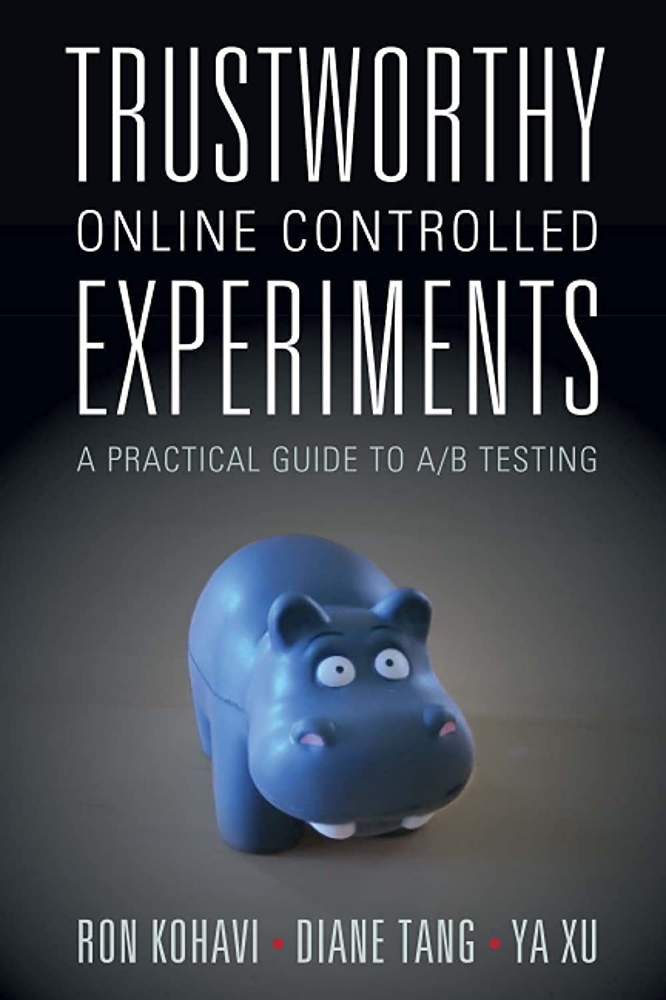
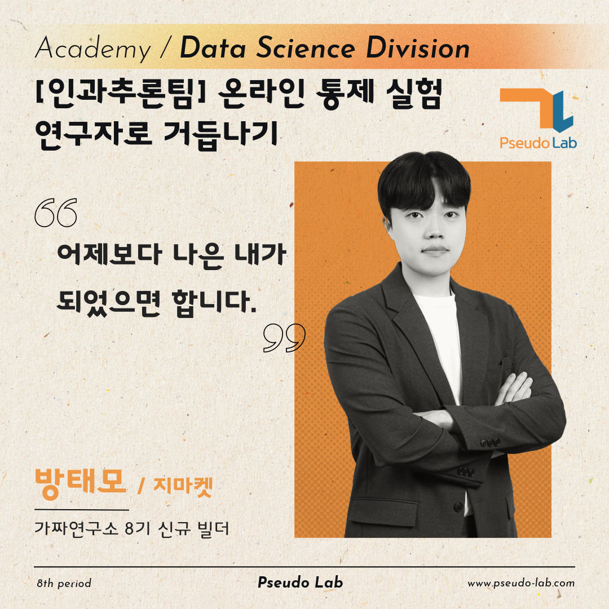
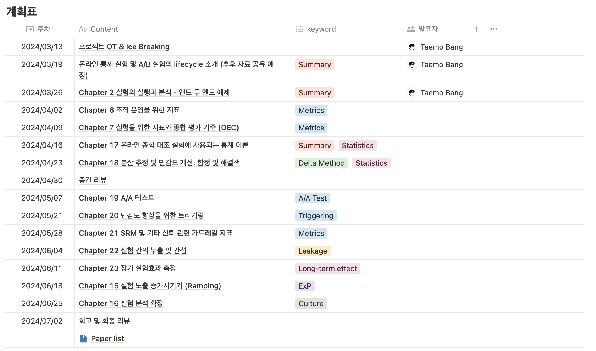

안녕하세요, 저는 온라인 통제 실험 연구자로 거듭나기 프로젝트를 빌드한 [방태모](https://www.taemobang.com/)입니다. 이 글에서는 2024년 상반기 제가 진행할 온라인 통제 실험 연구자 프로젝트에 대해서 간단히 소개합니다.

## 온라인 통제 실험 연구자 프로젝트 소개

### 프로젝트 개요

국내에 A/B Test와 관련한 주제로 쓰여진 글들은 여럿 존재합니다. 그러나, 대부분은 그들의 실험 플랫폼 구축기 내지는 이를 바탕으로 연간 \~번의 실험을 진행하며 형성한 그들만의 실험/데이터 기반 의사 결정 문화 또는 프로덕트 개선 결과 리뷰와 같은 주제에 지나지 않습니다.

신뢰할 수 있는 온라인 실험을 설계하고 및 분석하는 것, 실험 플랫폼을 통해 전사의 실험을 스케일업 하는 것에 있어서 마주했던 어려움, 그리고 이러한 어려움들을 어떻게 극복하였는지에 대해 구체적으로 이야기하는 글은 국내에서 찾아볼 수 없죠. 무엇보다 가장 걱정스러웠던 점은 A/B Test라는 디자인 자체의 단순함으로 인해, A/B Test를 쉽게 생각하는 사람들이 많다는 것입니다.

한가지 다행스러운 점은 수년전부터 온라인 통제 실험을 적극적으로 수행해온 해외 빅테크 기업에서는 이미 이러한 온라인 통제실험의 어려움, 함정, 극복 방법에 대해 논문화를 해두었다는 것입니다. 지금까지도 활발하게 관련 연구를 진행하고 있고요. 그들의 테크 블로그에서는 이러한 연구 논문 외에 유용한 아티클 또한 쉽게 찾아볼 수 있습니다.

A/B Test의 바이블이라고 불리는 책과 그들의 논문, 아티클을 스터디 자료로 사용할 예정입니다. 본 스터디를 통해 우리가 배운 것들을 공유함으로써 우리나라 Data Science 업계에도 신뢰할 수 있는 온라인 통제 실험의 어려움에 관한 경각심을 충분히 심어주고, 이를 극복하기 위한 엔지니어링적/통계적 방법론에 대해 활발한 논의가 오갈 수 있도록 작은 불씨 역할을 할 수 있었으면 합니다.

### 프로젝트 내용

본 프로젝트로 빌더에 지원할 때에는 논문 스터디를 위주로 진행하려고 했으나, 온라인 통제 실험에 관한 이해도가 서로 다른 상태에서 곧바로 논문 스터디를 진행하는 것은 어려움이 있을 것이라 생각했습니다. 그래서, 우선 현재 나와있는 온라인 통제 실험에 관한 유일한 책 [Kohavi et al., 2020](https://experimentguide.com/)를 바탕으로 상반기 스터디를 먼저 시작하려고 합니다. [번역본](http://www.acornpub.co.kr/book/trustworthy-abtest)은 여기서 만나보실 수 있습니다.

작년 9월부터 사내 스터디로 본 책을 공부하고 있는데, 친절한 책이라고 보긴 어렵습니다.😀 신뢰할 수 있는 온라인 통제 실험을 수행하기 위해 알아두어야 할 기본기들을 총 망라해놓은 책이긴 하지만, 행간이 생략된 부분이 많아서 실무에서 A/B Test를 수행해보신 분이 아니라면 이해하기 어려운 구절이 많습니다. 심지어, 저 같은 경우는 실무에서 A/B Test를 수행하고 있는 동료들과 해당 책을 함께 스터디 해도 한 번에 이해하기 어려운 내용들이 곳곳에 있었죠.

이 책에서 이야기하는 내용들을 100% 흡수하기 위해서는 이런 것들이 필요한 것 같아요.

-   실무에서 A/B Test를 수행하며 수많은 난관에 부딪힘과 동시에 본 책을 공부한다.

-   이해가 안되는 내용들은 책에 표기된 Reference를 찾아보고, 최소 Abstract, Introduction 정도는 읽어본다.

-   A/B Test에 관심이 있는 사람들 또는 실무에서 함께 실험을 진행하고 있는 사람들과 함께 본 책을 스터디한다.

문화적 관점의 내용, 엔지니어링 관점의 내용, 분석 관점의 내용이 모두 망라된 책이라, 혼자 스터디할 경우 분명히 한계가 있을 책이라고 생각합니다. 본 프로젝트를 통해 각자의 백그라운드, 다양한 도메인의 러너들이 함께 이 책을 가지고 스터디함으로써, 서로의 해상도를 공유하고 서로 더 많은 것들을 얻어갈 수 있을거라고 기대하고 있습니다. 상반기 스터디를 잘 끝낸 다음에는 하반기에는 해외 테크 기업들의 논문, 아티클을 바탕으로 차근차근 최신 연구를 쫓아갈 계획을 가지고 있습니다.

\*가짜연구소 8기에서 진행되는 프로젝트는 [계획표](https://www.notion.so/chanrankim/ac8f46b9011549999c6c3f18d4a3c5cb?v=1f3bf7ae8b3244a297003b157b0331c5&pvs=4)를 참고해주세요.

## 빌더 소개

-   안녕하세요, 아카데미 빌더 8기로 인과추론 팀에 합류한 방태모입니다.

-   G마켓 AI Product 팀에서 Data Scientist 포지션으로 일하고 있어요.

-   요즘은 신뢰할 수 있는 온라인 통제 실험을 연구하는 것에 가장 큰 관심을 두고 있어요.

-   보다 자세한 제 소개는 여기를 참고해주세요.😀

    -   [Taemo Bang \| LinkedIn](https://www.linkedin.com/in/taemo/)

## 프로젝트 계획

### 학습 목표

-   신뢰할 수 있는 온라인 통제 실험을 위한 통계적 방법론 정리

-   온라인 통제 실험 기법, 실험 지표에 관한 정리

### 스터디에 활용할 자료

-   주 교재: [신뢰할 수있는 온라인 종합 대조 실험](http://www.acornpub.co.kr/book/trustworthy-abtest)

-   보조 자료: 해외 테크 기업 논문 및 아티클

### 스터디 활동 방법

1.  **스터디 시작 전, 열심히 자습해오기**
    -   스터디 계획표를 참고하여 해당 주제 학습하기
    -   이해가 어려운 부분이 있다면
        -   레퍼런스 논문 또는 관련 아티클 찾아서 읽어보기
        -   팀원들에게 도움 요청해보기
2.  **스터디 중, 우리의 자세**
    -   발표자가 공유해주는 내용 중 나누고 싶은 이야기가 있다면, 언제든지 부담없이 끼어들어 이야기 나누기
    -   나와 이해가 다른 부분이 보인다면 공유하고 맞춰보기
3.  **스터디 후, 결과물 만들기**
    -   발표 자료 [팀 Github](https://github.com/CausalInferenceLab/OCE-Materials/tree/main) 공유 (양식 자유)
    -   어려웠던 부분 / 질문 / 기타 참고 자료 [Issues](https://github.com/CausalInferenceLab/OCE-Materials/issues)에 정리 (남겨둘만한 부분에 한해서)
    -   그간 스터디 한 것들을 바탕으로 팀 블로그에 정리하고 싶은 글감이 생각난다면 함께 논의해보고 정리하기
        -   실험 조정 계획, 지표 설계, 통계적 방법론, 데이터 시각화 등

## 주차별 목표

### 스케줄

-   OT는 3월 13일 (수) 오후 7시 30분으로 오프라인에서 진행예정입니다.

-   이후 스터디는 매주 화요일 오후 7시 30분부터 약 60-120분 간 진행 예정입니다.

-   청강 가능하고, 스터디 하는 날 가짜연구소 디스코드 청강 채널을 통해 공지드릴 예정입니다.

### 주차별 목표

-   프로젝트 OT 후, 2주차에는 제가 온라인 통제 실험 기초 및 일부 통계적 방법론에 관한 전반적인 소개를 드리고자 합니다.

-   첫 책 스터디 시작인 3주차는 러너분들이 부담이 있으실 수 있으니 먼저 첫 발표를 하려고 하고요.

-   그 이후 주차의 발표 순서는 무작위로 정하려고 합니다.😀

▶️ [노션 계획표 보러가기](https://www.notion.so/chanrankim/6f637b9572f14c61b6ae84c2739ffc41?pvs=4)
