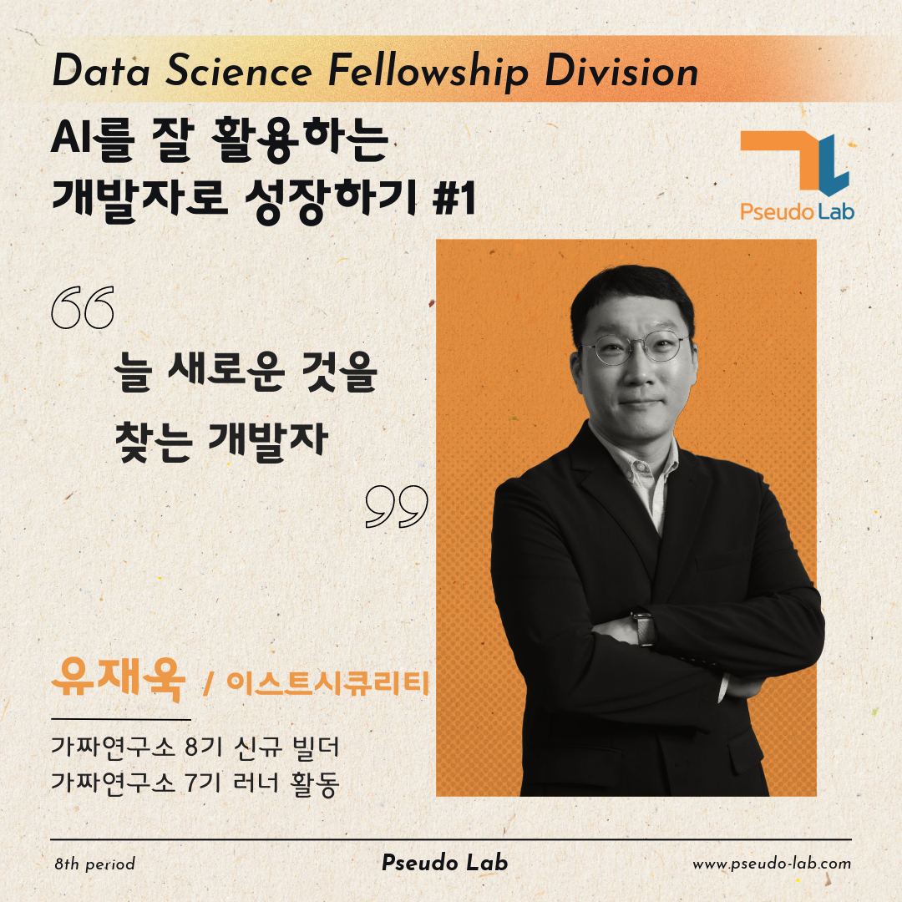

안녕하세요, 저는 "AI를 잘 활용하는 개발자로 성장하기 #1" 프로젝트를 빌드한 유재욱입니다.
이 글에서는 2024년 상반기 제가 진행할 "AI를 잘 활용하는 개발자로 성장하기 #1" 프로젝트에 대해서 간단히 소개합니다.

## AI를 잘 활용하는 개발자로 성장하기 #1 프로젝트 소개

**스터디/프로젝트 내용**

- 13주 동안 [DataCamp](https://app.datacamp.com/)에서 매주 8시간 정도의 개발과 관련된 수업을 수강합니다. ‘AI를 잘 활용하는 개발자로 성장하기’ 파트 1은 개발과 관련된 기본적인 내용으로 진행합니다. [DataCamp](https://app.datacamp.com/)의 [Career Track: Python Developer](https://app.datacamp.com/learn/career-tracks/python-programmer) 과정과 [Skill Track: SQL Fundamentals](https://app.datacamp.com/learn/skill-tracks/sql-fundamentals) 과정의 수업을 각자 수강합니다.
- 주 1회 정기모임 시간을 통해 각자 공부한 내용을 서로 공유하고 토론하며 성장합니다.

**스터디/프로젝트 목적**

- [DataCamp](https://app.datacamp.com/)의 [Career Track: Python Developer](https://app.datacamp.com/learn/career-tracks/python-programmer) 과정을 수료합니다.
- 소프트웨어 엔지니어링, 데이터 사이언스, 데이터 엔지니어링으로 배움의 영역을 확장하기 위한 기반을 다지는 것을 목표로 합니다.

**프로젝트 페이지**

- [AI를 잘 활용하는 개발자로 성장하기 #1 프로젝트 페이지](https://pseudo-lab.com/AI-1-79c7432d8df7486eaac34ea8f22a1e29)에서 진행상황을 확인하실 수 있습니다.
- 가짜연구소 8기에서 진행되는 프로젝트는 [계획표](https://www.pseudo-lab.com/d16a59aa6f3847a092f8d55b89279b0)를 참고해주세요.

## 빌더 소개

{: width="500" height="500"}

- 안녕하세요. "AI를 잘 활용하는 개발자로 성장하기 #1" 빌더 유재욱입니다. 함께 공부하고자 빌더에 지원했습니다! 함께 성장해보시죠!
- [Blog](https://jaewook.blog/)
- [LinkedIn](https://www.linkedin.com/in/jaewook-kr/)

## 프로젝트 계획

**모임 시간 및 장소**
- 시간: 매주 화요일 오후 10시
- 장소: 온라인 디스코드 Room-DH
- 청강 가능합니다.

**학습 자료**

- [DataCamp](https://app.datacamp.com/)에서 제공하는 수업
    - [Career Track: Python Developer](https://app.datacamp.com/learn/career-tracks/python-programmer): 기본 개발자 과정을 완주하는 것을 목표로 합니다.
    - [Skill Track: SQL Fundamentals](https://app.datacamp.com/learn/skill-tracks/sql-fundamentals): SQL에 대한 일부 수업을 수료합니다.

**스터디 활동 방법**

- DataCamp에서 지정된 강의를 수강하고, 주 1회 온라인 모임에서 한 주 동안 학습한 내용을 공유하고 토론합니다.

## 주차별 목표

| 주차 | 주제 |
|-------|----------------------------------------------------------|
| OT | OT (스터디 소개/방향 논의, Ice Breaking) |
| 1주차 | Course: Introduction to Python |
| 2주차 | Course: Intermediate Python, Project: Investigating Netflix Movies |
| 3주차 | Course: Data Manipulation with pandas, Project: Exploring NYC Public School Test Result Scores |
| 4주차 | Course: Python Data Science Toolbox (Part 1, 2) |
| 5주차 | Course: Data Types for Data Science in Python, Course: Writing Efficient Python Code |
| 6주차 | Course: Working with Dates and Times in Python, Course: Regular Expressions in Python |
| 7주차 | Course: Web Scraping in Python, 중간 리뷰 타임 |
| 8주차 | Course: Writing Functions in Python, Course: Data Structures and Algorithms in Python |
| 9주차 | Course: Introduction to Shell, Course: Introduction to Git |
| 10주차 | Course: Software Engineering Principles in Python, Course: Developing Python Packages |
| 11주차 | Course: Unit Testing for Data Science in Python, Course: Object-Oriented Programming in Python |
| 12주차 | Course: Introduction to SQL, Course: Intermediate SQL |
| 13주차 | Course: Joining Data in SQL, Course: Data Manipulation in SQL |
| 14주차 | 회고 및 최종 리뷰, Part 1 마무리 |
