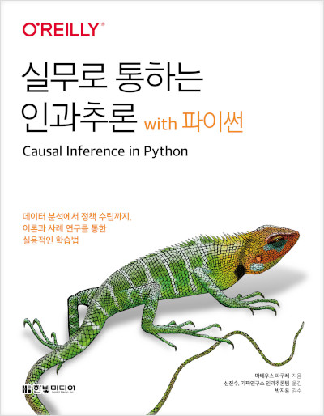
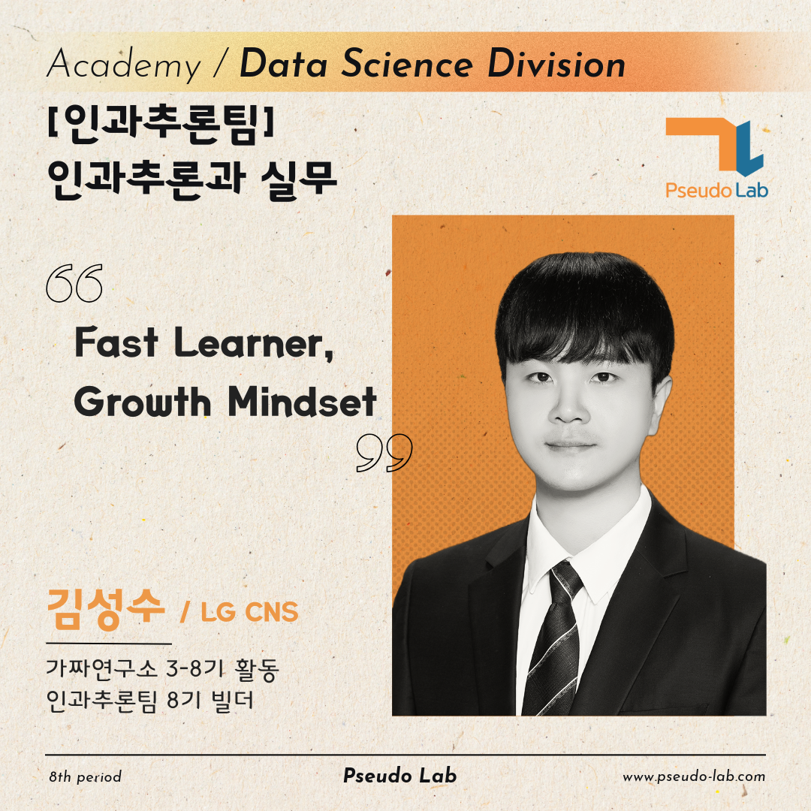
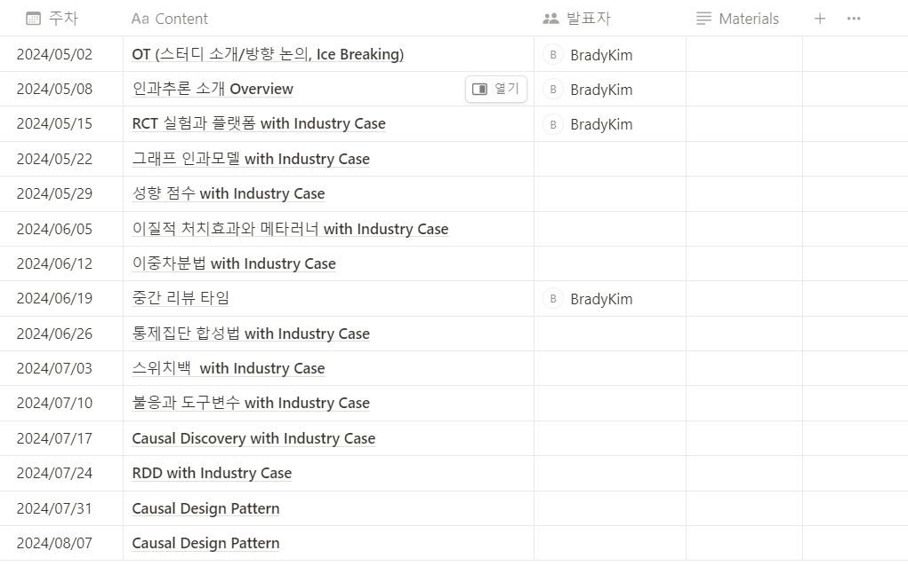

안녕하세요, 저는 인과추론과 실무 프로젝트를 빌드한 [김성수](https://www.linkedin.com/in/%EC%84%B1%EC%88%98-%EA%B9%80-50825717b/)입니다. 이 포스팅에서는 2024년 상반기 제가 진행할 인과추론과 실무 프로젝트에 대해서 간단히 소개하고자 합니다.

## 인과추론과 실무 프로젝트 소개

### 프로젝트 개요

산업 현장에서 인과추론을 적용하는 것은 여전히 어려운 과제로 남아 있습니다. 실제로 대부분의 인과추론은 학술적인 연구에서 이루어졌습니다. 학술적 연구는 일반적으로 이론을 기반으로 한 연구 질문, 실험 설계, 최종 결론까지의 진행이 느리며, 인과관계의 결론과 함께 실험 결과의 신뢰성을 확보하기 위해 노력합니다. 많은 연구에서 Sensitivity analysis, Robustness Check, 매커니즘 체크 등의 검증을 통해 재현성을 보장하기 위해 충분한 시간을 들여 검증하고 있습니다.

하지만 실무에서는 시간이 돈이기 때문에, 복잡한 검증 방식, 이론에 기반한 Research Question에 집중하는것 보단 표준적이고 잘 정립된 방법론을 활용하는 것이 중요할 수 있습니다. 또한, 우리는 DoWhy와 EconML 패키지의 Sensitivity Application을 활용해 빠르게 결론의 Robustness를 검증할 수 있습니다. 더 나아가, ChatGPT가 산업의 Domain Expert가 되어서 Causal Reasoning을 도와줄 수도 있죠.

이외에도, 실무에서 인과추론 문제를 만났을 때 실무자는 상황에 맞게 다양한 인과추론 방법론을 동시에 또는 구조적으로 활용해야 합니다. 따라서 인과추론에 익숙하지 않은 실무자는 현업에서 인과추론 문제를 만났을 때 이를 적용하기 어렵습니다.

본 프로젝트의 목적은 실무에 적용 가능한 다양한 인과추론 End-to-End 예제를 학습하고, 실무 적용 가능성을 탐구하는 것입니다. 다시 말해, 인과추론 방법론을 실무에 적용하기 위해 실무 사례를 통해 산업계에서 활용하는 표준적인 방법론을 탐구하고, 이를 템플릿화하는 것이 목표입니다. 

예를 들어, 그래프 인과 모형을 학습한 후, 이를 어떻게 실무에 적용할 수 있는지 발표하고 토론합니다. 또한, 이를 쉽게 적용할 수 있는 F/W와 플랫폼에도 관심을 가지려고 합니다.

### 프로젝트 내용

인과 추론은 다양한 방법들의 집합체이기 때문에, 인과추론을 배우는 실무자가 여러 가지 인과추론 방법을 구조적으로 이해하고 활용하기에는 어려움이 있습니다. 

따라서 시작부터 구체적인 실무 케이스를 바라보는 것보다는 인과추론에 구체적으로 어떠한 방법이 존재하고, 방법의 핵심이 무엇인지 파악하는것이 중요하다고 생각했습니다. 

우선 크래프톤의 신진수님과 인과추론팀이 번역하여 출판한 [실무로 통하는 인과추론 with Python](https://product.kyobobook.co.kr/detail/S000212577153)을 바탕으로 인과추론 방법을 학습하고, 해당 방법을 활용한 실무 사례를 정리하는 방식으로 스터디를 시작하려고 합니다. 

### 프로젝트의 주요 질문

- 왜 특정 인과추론 기법을 이러한 비즈니스 문제를 해결하기 위해 적용하였을까요?
- 플랫폼 고객 경험에 부정적인 영향을 줄 수 있는 실험 설계에서 어떻게 인과추론 방법을 적용할 수 있을까요?
- 인과추론 머신러닝 파이프라인을 자동화하고 싶어요.
- 제조 현장의 대부분을 차지하는 관측 데이터(Observational data)에서 어떻게 인과관계를 추론하여 현업의 의사결정을 도울 수 있을까요?

## 빌더 소개

-   안녕하세요. 8기 빌더로 활동하게된 김성수라고 합니다.

-   LG CNS Enterprise Data 분석팀에서 Data Scientist 포지션으로 일하고 있어요.

-   머신러닝 시스템 구축 및 현장의 난제를 해결하기 위한 머신러닝 어플리케이션을 연구하고 있습니다.

-   보다 자세한 제 소개는 여기를 참고해주세요.😀

    -   [SEONGSU KIM \| LinkedIn](https://www.linkedin.com/in/%EC%84%B1%EC%88%98-%EA%B9%80-50825717b/)

## 프로젝트 계획

### 학습 목표

-   상황에 맞는 인과추론 방법론을 선택하여 현업에 적용할 수 있는 실무자로 거듭나기

-   드래곤볼 모으기: 광활한 인터넷 공간에 흩어져 있는 인과추론의 실무 사례 템플릿 및 한글화

-   인과추론 실무 사례 템플릿화 

### 스터디에 활용할 자료

- 주 교재:

  (1) [실무로 통하는 인과추론 with Python](https://product.kyobobook.co.kr/detail/S000212577153)

  (2) 인과추론을 활용한 실무 자료 (Research Paper, 빅테크 블로그)
  1. [Netflix Research](https://research.netflix.com/research-area/experimentation-and-causal-inference)
  2. [KDD 2023 Workshop - Causal Inference and Machine Learning in Practice](https://causal-machine-learning.github.io/kdd2023-workshop/)
  4. [Uber](https://www.uber.com/en-KR/blog/causal-inference-at-uber/)
  5. [PDAMS 23](https://www.youtube.com/watch?v=rkP4TK1SPVQ)

## 주차별 목표

### 스케줄

-   첫 OT는 5월 2일 (목) 오후 7시 30분으로 오프라인에서 진행예정

-   이후 스터디는 매주 수요일 오후 7시 30분부터 약 2시간동안 진행예정

### 주차별 목표

-   프로젝트 첫 3주차에는 OT, 인과추론의 전반적인 소개 및 RCT에 대해서 학습하고자 합니다.

-   첫 프로젝트 시작인 3주차는 러너분들이 부담이 있으실 수 있으니 먼저 첫 발표를 하려고 합니다.

-   그 이후 주차의 발표 순서는 OT에 함께 선정해봐요😀

▶️ [노션 계획표 보러가기](https://www.notion.so/chanrankim/fbedd72840044519a50c35c312fbebe2?pvs=4)
